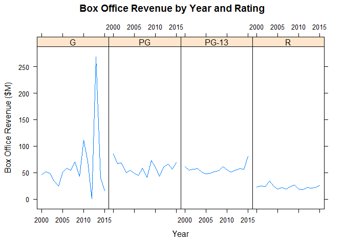
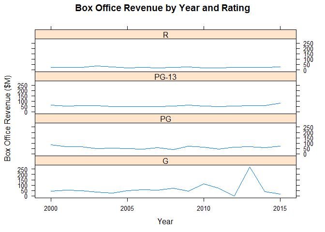
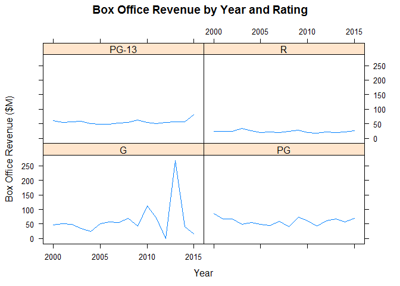
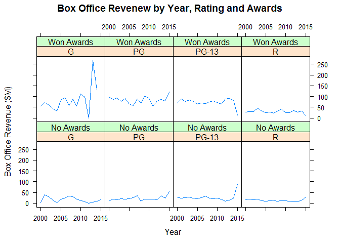
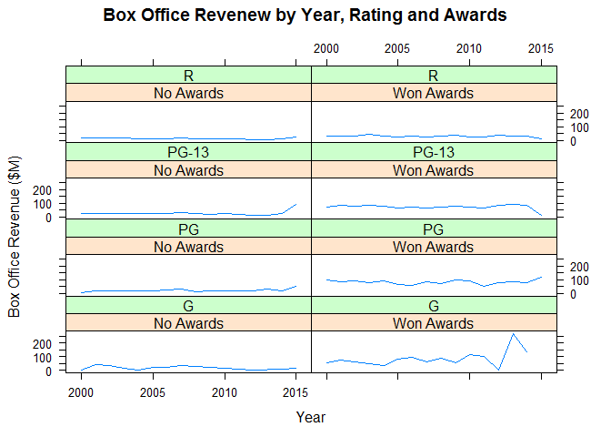

Demo - Lattice
================

``` r
library(lattice)
```

    ## Warning: package 'lattice' was built under R version 3.5.2

``` r
timeSeries2 <- read.csv("../data/TimeSeries2.csv")
head(timeSeries2)
```

    ##   Year Rating Box.Office
    ## 1 2000      G   46.13333
    ## 2 2000     PG   85.74286
    ## 3 2000  PG-13   61.24286
    ## 4 2000      R   23.07253
    ## 5 2001      G   51.82000
    ## 6 2001     PG   66.84118

Horizontal Facet
----------------

Create horizontal facets

``` r
title <- "Box Office Revenue by Year and Rating"
x_lab <- "Year"
y_lab <- "Box Office Revenue ($M)"


xyplot(
  data = timeSeries2,
  x = Box.Office ~ Year | Rating,
  type = "l",
  layout = c(4,1),
  main = title,
  xlab=x_lab,
  ylab = y_lab)
```



Vertical Facet
--------------

Create vertical facets

``` r
xyplot(
  data = timeSeries2,
  x = Box.Office ~ Year | Rating,
  type = "l",
  layout = c(1,4),
  main = title,
  xlab =x_lab,
  ylab = y_lab)
```



Wrapped Facet
-------------

``` r
xyplot(
  data = timeSeries2,
  x = Box.Office ~ Year | Rating,
  main = title,
  xlab = x_lab,
  ylab = y_lab,
  layout = c(2,2),
  type = "l")
```



Load row-based time series
--------------------------

``` r
timeSeries3 <- read.csv("../data/TimeSeries3.csv")
head(timeSeries3)
```

    ##   Year Rating     Awards Box.Office
    ## 1 2000      G  No Awards    2.00000
    ## 2 2000      G Won Awards   54.96000
    ## 3 2000     PG  No Awards    9.00000
    ## 4 2000     PG Won Awards   98.53333
    ## 5 2000  PG-13  No Awards   28.00000
    ## 6 2000  PG-13 Won Awards   69.55357

2D Faceted grid (Horizontal)
----------------------------

Create a 2-dimensional faceted grid

``` r
title <- "Box Office Revenew by Year, Rating and Awards"

xyplot(
  x = Box.Office ~ Year | Rating * Awards,
  data = timeSeries3,
  type = "l",
  main = title,
  xlab = x_lab,
  ylab = y_lab)
```



2D Faceted grid (Vertical)
--------------------------

Create a 2-dimensional faceted grid

``` r
xyplot(
  data = timeSeries3,
  x = Box.Office ~ Year | Awards * Rating,
  type = "l",
  main = title,
  xlab = x_lab,
  ylab = y_lab)
```


