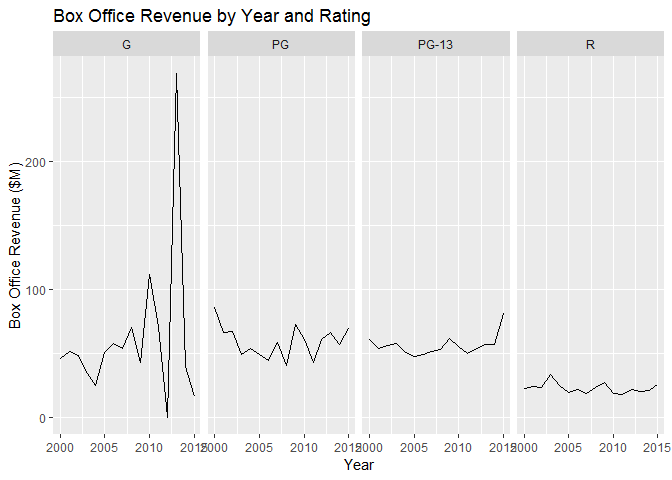
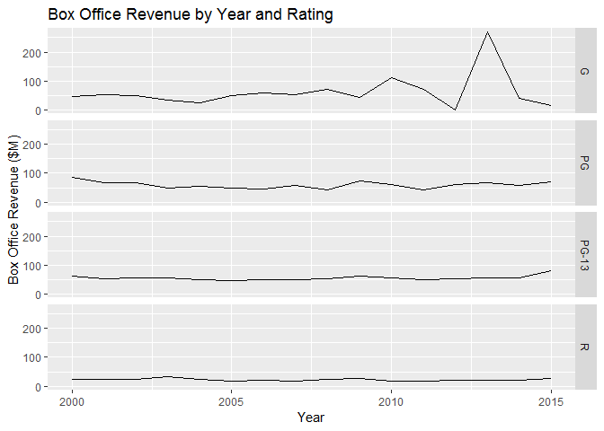
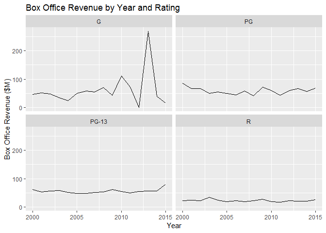
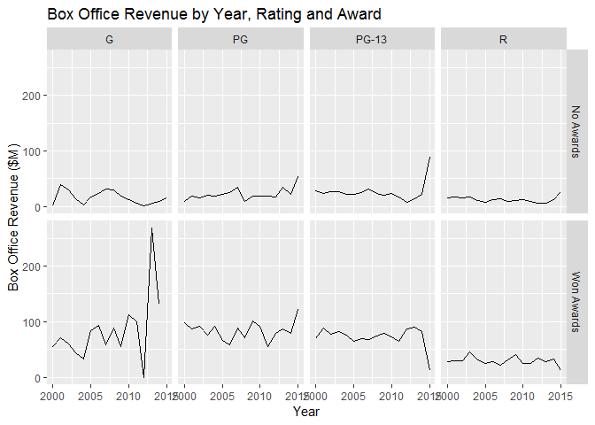
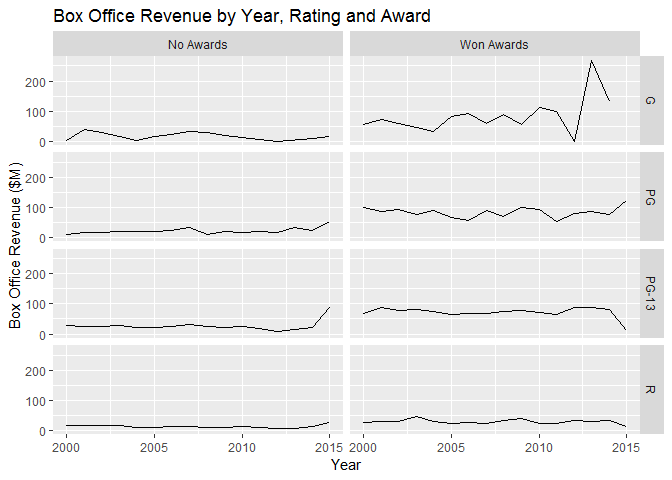

Demo - GGPlot
================

``` r
library(ggplot2)

timeSeries2 <- read.csv("../data/TimeSeries2.csv")
head(timeSeries2)
```

    ##   Year Rating Box.Office
    ## 1 2000      G   46.13333
    ## 2 2000     PG   85.74286
    ## 3 2000  PG-13   61.24286
    ## 4 2000      R   23.07253
    ## 5 2001      G   51.82000
    ## 6 2001     PG   66.84118

``` r
title <- "Box Office Revenue by Year and Rating"
x_lab <- "Year"
y_lab <- "Box Office Revenue ($M)"
```

Horizontal Facets
-----------------

``` r
ggplot(
  data = timeSeries2,
  aes(x=Year,y=Box.Office)) +
  geom_line()+
  facet_grid(
    facets = .~Rating) + # Rows ~ Columns
  ggtitle(title) +
  xlab(x_lab) +
  ylab(y_lab) 
```



Vertical Facet
--------------

``` r
ggplot(
  data = timeSeries2,
  aes(x = Year, y = Box.Office)) +
  geom_line() +
  facet_grid(facets = Rating~.) +
  ggtitle(title) +
  xlab(x_lab) +
  ylab(y_lab)
```



Wrapped Facet
-------------

``` r
ggplot(
  data = timeSeries2,
  aes( x= Year, y = Box.Office)) +
  ggtitle(title) +
  xlab(x_lab) +
  ylab(y_lab) +
  geom_line() +
  facet_wrap(
    facets = ~ Rating)
```



2D Facets (Horizontal)
----------------------

``` r
title <- "Box Office Revenue by Year, Rating and Award"
timeSeries3 = read.csv("../data/TimeSeries3.csv")

ggplot(
  data = timeSeries3,
  aes(x = Year, y = Box.Office)) +
  geom_line() +
  ggtitle(title) +
  xlab(x_lab) +
  ylab(y_lab) +
  facet_grid(facets = Awards ~ Rating)
```



2D Facets (Vertical)
--------------------

``` r
ggplot(
  data = timeSeries3,
  aes(x = Year, y = Box.Office)) +
  geom_line() +
  ggtitle(title)+
  xlab(x_lab) +
  ylab(y_lab) +
  facet_grid(facets = Rating ~ Awards )
```


