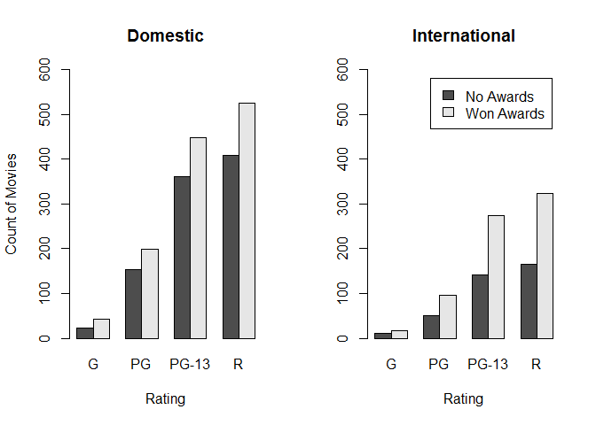
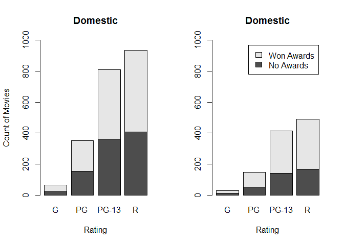
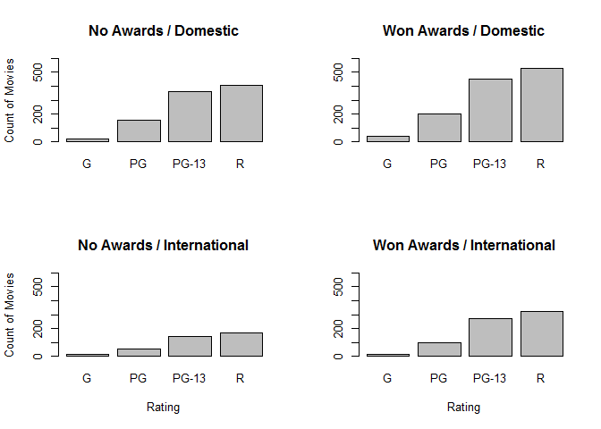

Qualitative Trivariate Analysis
================

Charts
======

``` r
movies <- read.csv("../data/movies.csv")
head(movies)
```

    ##                   Title Year Rating Runtime Critic.Score Box.Office
    ## 1  The Whole Nine Yards 2000      R      98           45       57.3
    ## 2      Cirque du Soleil 2000      G      39           45       13.4
    ## 3             Gladiator 2000      R     155           76      187.3
    ## 4              Dinosaur 2000     PG      82           65      135.6
    ## 5     Big Momma's House 2000  PG-13      99           30        0.5
    ## 6 Gone in Sixty Seconds 2000  PG-13     118           24      101.0
    ##       Awards  Distribution
    ## 1  No Awards      Domestic
    ## 2 Won Awards      Domestic
    ## 3 Won Awards International
    ## 4 Won Awards      Domestic
    ## 5 Won Awards International
    ## 6 Won Awards      Domestic

Function to creat Contingency tables

``` r
getTable <- function(distribution){
  filter <- movies$Distribution == distribution
  subset <- movies[filter,]
  table(
    x = subset$Awards,
    y = subset$Rating)
}
```

Displaying contingency tables

``` r
getTable("Domestic")
```

    ##             y
    ## x              G  PG PG-13   R
    ##   No Awards   22 153   361 408
    ##   Won Awards  43 198   449 526

``` r
getTable("International")
```

    ##             y
    ## x              G  PG PG-13   R
    ##   No Awards   12  50   141 166
    ##   Won Awards  16  96   274 323

Faceted Grouped Frequency Bar Chart
-----------------------------------

``` r
par(mfrow = c(1,2))
domestic_axes_title <- "Domestic"
international_axes_title <- "International"
rating_axes_title <- "Rating"
count_movies_axes_title <- "Count of Movies"

barplot(
  height = getTable("Domestic"),
  beside = TRUE,
  ylim = c(0,600),
  main = domestic_axes_title,
  xlab = rating_axes_title,
  ylab = count_movies_axes_title)

barplot(
  height = getTable("International"),
  beside = TRUE,
  ylim = c(0,600),
  main = international_axes_title,
  xlab = rating_axes_title,
  legend = rownames(getTable("International")))
```



Faceted Stacked Frequency Bar Chart
-----------------------------------

``` r
par(mfrow = c(1,2))
barplot(
  height = getTable("Domestic"),
  beside = FALSE, # Default
  ylim = c(0,1000),
  main = domestic_axes_title,
  xlab = rating_axes_title,
  ylab = count_movies_axes_title)

barplot(
  height = getTable("International"),
  ylim = c(0,1000),
  beside = FALSE, # Default
  main = domestic_axes_title,
  xlab = rating_axes_title,
  legend = rownames(getTable("International")))
```



Faceted Frequency Bar Chart
---------------------------

Function to create frequency table

``` r
getTable2 <- function(awards, distribution){
  
  filter <- movies$Awards == awards & movies$Distribution == distribution
  subset <-movies[filter, ]
  table(subset$Rating)
}
```

Print frequency tables

``` r
getTable2("No Awards", "Domestic")
```

    ## 
    ##     G    PG PG-13     R 
    ##    22   153   361   408

``` r
getTable2("Won Awards","Domestic")
```

    ## 
    ##     G    PG PG-13     R 
    ##    43   198   449   526

``` r
getTable2("No Awards","International")
```

    ## 
    ##     G    PG PG-13     R 
    ##    12    50   141   166

``` r
getTable2("Won Awards","International")
```

    ## 
    ##     G    PG PG-13     R 
    ##    16    96   274   323

Charts

``` r
par(mfrow = c(2,2))

barplot(
  height = getTable2("No Awards", "Domestic"),
  ylim = c(0,600),
  main = "No Awards / Domestic",
  ylab = "Count of Movies")


barplot(
  height = getTable2("Won Awards", "Domestic"),
  ylim = c(0,600),
  main = "Won Awards / Domestic")


barplot(
  height = getTable2("No Awards", "International"),
  ylim = c(0,600),
  main = "No Awards / International",
  ylab = "Count of Movies",
  xlab = "Rating")


barplot(
  height = getTable2("Won Awards", "International"),
  ylim = c(0,600),
  main = "Won Awards / International",
  xlab = "Rating")
```



``` r
par(mfrow= c(1,1)) # Reset the default behavior
```
