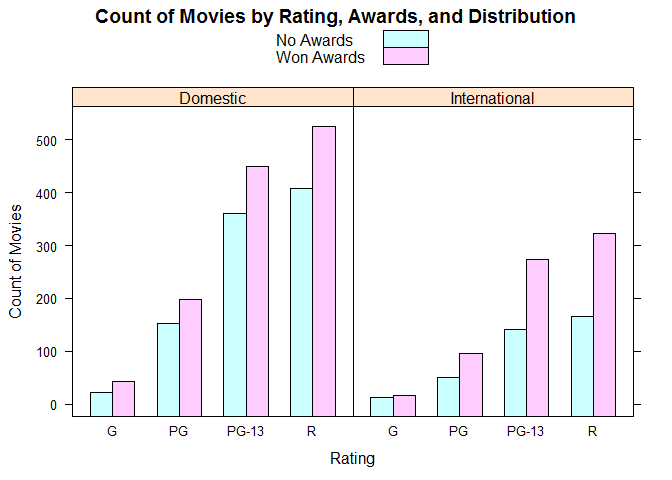
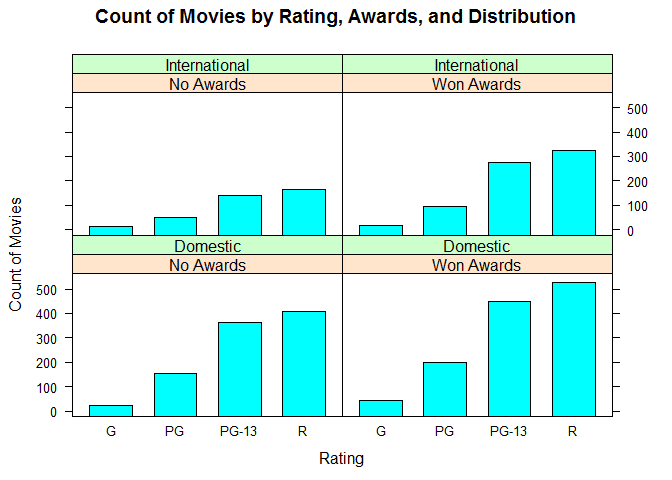

Qualitative Trivariate Analysis
================

Charts
======

``` r
library(tidyverse)
```

    ## Warning: package 'tidyverse' was built under R version 3.5.2

    ## -- Attaching packages --------------------------------------- tidyverse 1.2.1 --

    ## v ggplot2 3.0.0     v purrr   0.2.5
    ## v tibble  1.4.2     v dplyr   0.7.6
    ## v tidyr   0.8.1     v stringr 1.3.1
    ## v readr   1.1.1     v forcats 0.3.0

    ## -- Conflicts ------------------------------------------ tidyverse_conflicts() --
    ## x dplyr::filter() masks stats::filter()
    ## x dplyr::lag()    masks stats::lag()

``` r
library(lattice)
```

    ## Warning: package 'lattice' was built under R version 3.5.2

``` r
movies <- read.csv("../data/movies.csv")
head(movies)
```

    ##                   Title Year Rating Runtime Critic.Score Box.Office
    ## 1  The Whole Nine Yards 2000      R      98           45       57.3
    ## 2      Cirque du Soleil 2000      G      39           45       13.4
    ## 3             Gladiator 2000      R     155           76      187.3
    ## 4              Dinosaur 2000     PG      82           65      135.6
    ## 5     Big Momma's House 2000  PG-13      99           30        0.5
    ## 6 Gone in Sixty Seconds 2000  PG-13     118           24      101.0
    ##       Awards  Distribution
    ## 1  No Awards      Domestic
    ## 2 Won Awards      Domestic
    ## 3 Won Awards International
    ## 4 Won Awards      Domestic
    ## 5 Won Awards International
    ## 6 Won Awards      Domestic

We need to create a three-way contingency table

``` r
table <- movies %>%
  select(Rating, Awards, Distribution) %>%
  group_by(Rating, Awards, Distribution) %>%
  summarize(Count= n())

head(table)
```

    ## # A tibble: 6 x 4
    ## # Groups:   Rating, Awards [3]
    ##   Rating Awards     Distribution  Count
    ##   <fct>  <fct>      <fct>         <int>
    ## 1 G      No Awards  Domestic         22
    ## 2 G      No Awards  International    12
    ## 3 G      Won Awards Domestic         43
    ## 4 G      Won Awards International    16
    ## 5 PG     No Awards  Domestic        153
    ## 6 PG     No Awards  International    50

Faceted Grouped Frequency Bar Chart
-----------------------------------

``` r
table %>%
  barchart(
    x = Count ~ Rating | Distribution,
    groups = Awards,
    main = "Count of Movies by Rating, Awards, and Distribution",
    xlab = "Rating",
    ylab = "Count of Movies",
    auto.key = TRUE) # Let Lattice to generate the legend.
```



Faceted Stacked Frequency Bar Chart
-----------------------------------

``` r
table %>%
  barchart(
    x = Count ~ Rating | Distribution,
    groups = Awards,
    stack = TRUE,
    main = "Count of Movies by Rating, Awards, and Distribution",
    xlab = "Rating",
    ylab = "Count of Movies",
    auto.key = TRUE) # Let Lattice to generate the legend.
```


Faceted Frequency Bar Chart
---------------------------

``` r
table %>%
  barchart( 
    x = Count ~ Rating | Awards * Distribution,
    main = "Count of Movies by Rating, Awards, and Distribution",
    xlab = "Rating",
    ylab = "Count of Movies",
    auto.key = TRUE) # Let Lattice to generate the legend.
```


