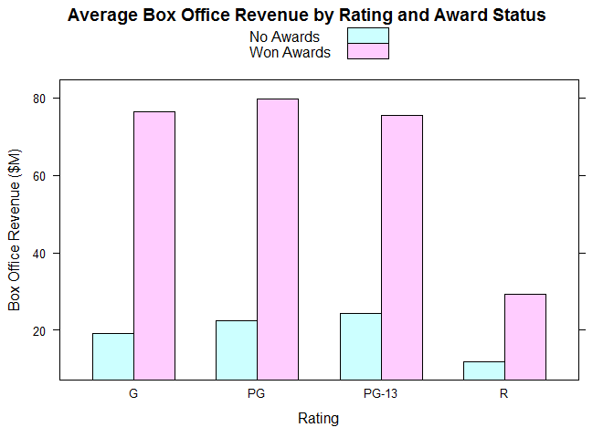
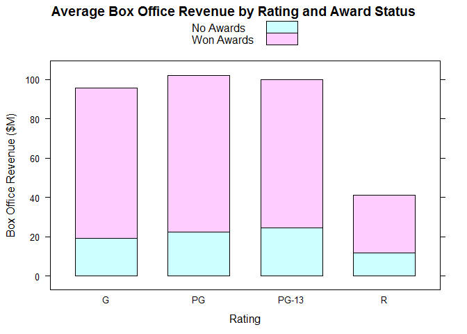
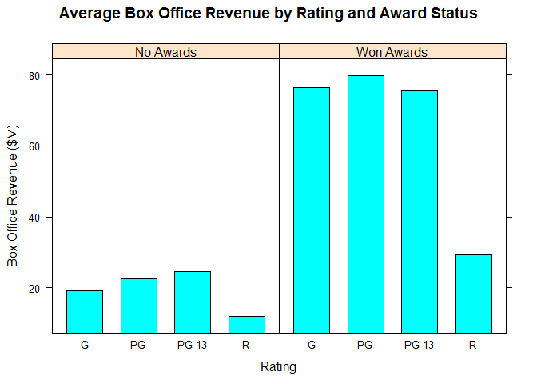
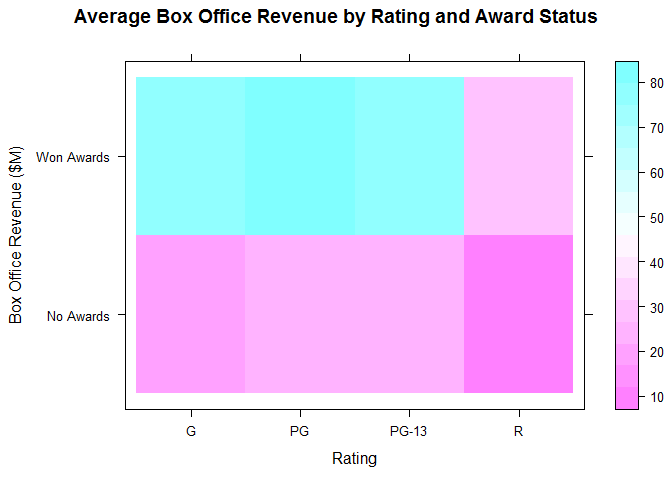

Trivariate Analysis for 2 Quantitative and 1 Qualitative variables
================

Charts
======

``` r
library(tidyverse)
```

    ## Warning: package 'tidyverse' was built under R version 3.5.2

    ## -- Attaching packages ------------------------------------------------------------------------ tidyverse 1.2.1 --

    ## v ggplot2 3.0.0     v purrr   0.2.5
    ## v tibble  1.4.2     v dplyr   0.7.6
    ## v tidyr   0.8.1     v stringr 1.3.1
    ## v readr   1.1.1     v forcats 0.3.0

    ## -- Conflicts --------------------------------------------------------------------------- tidyverse_conflicts() --
    ## x dplyr::filter() masks stats::filter()
    ## x dplyr::lag()    masks stats::lag()

``` r
library(lattice)
```

    ## Warning: package 'lattice' was built under R version 3.5.2

``` r
movies <- read.csv("../data/movies.csv")

table2 <- movies %>%
  select(Rating, Awards, Box.Office) %>%
  group_by(Rating, Awards) %>%
  summarize(Box.Office = mean(Box.Office))

head(table2)
```

    ## # A tibble: 6 x 3
    ## # Groups:   Rating [3]
    ##   Rating Awards     Box.Office
    ##   <fct>  <fct>           <dbl>
    ## 1 G      No Awards        19.2
    ## 2 G      Won Awards       76.4
    ## 3 PG     No Awards        22.4
    ## 4 PG     Won Awards       79.9
    ## 5 PG-13  No Awards        24.4
    ## 6 PG-13  Won Awards       75.5

Grouped Bar Chart
-----------------

``` r
table2 %>%
  barchart(
    x = Box.Office ~ Rating,
    groups = Awards,
    main = "Average Box Office Revenue by Rating and Award Status",
    xlab = "Rating",
    ylab = "Box Office Revenue ($M)",
    auto.key =TRUE)
```



Stacked Bar Chart
-----------------

``` r
table2 %>%
  barchart(
    x = Box.Office ~ Rating,
    groups = Awards,
    main = "Average Box Office Revenue by Rating and Award Status",
    xlab = "Rating",
    ylab = "Box Office Revenue ($M)",
    auto.key =TRUE,
    stack = TRUE)
```



Faceted Bar Chart
-----------------

``` r
barchart(
  x = Box.Office ~ Rating | Awards,
  data = table2,
  layout = c(2,1),
  main = "Average Box Office Revenue by Rating and Award Status",
  xlab = "Rating",
  ylab = "Box Office Revenue ($M)")
```



Heat Map
--------

``` r
levelplot(
  x = Box.Office ~ Rating * Awards,
  data = table2,
  main = "Average Box Office Revenue by Rating and Award Status",
  xlab = "Rating",
  ylab = "Box Office Revenue ($M)")
```


