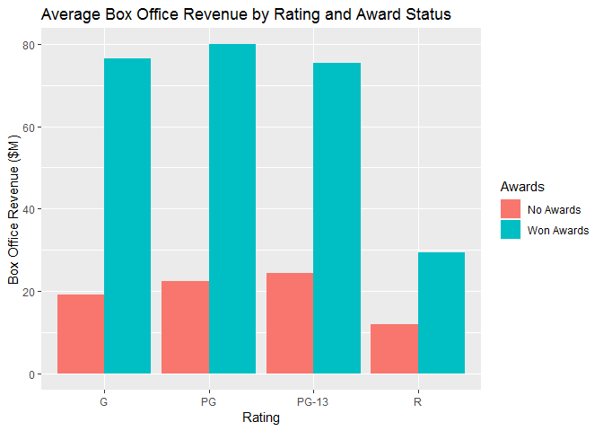
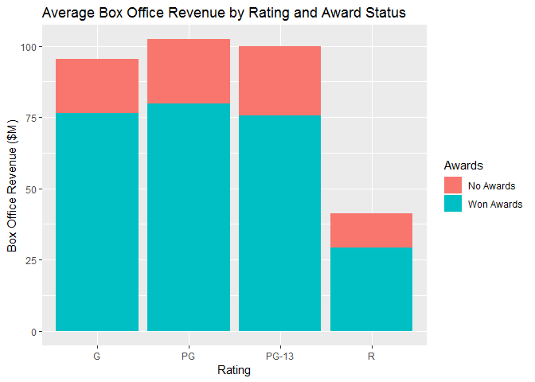
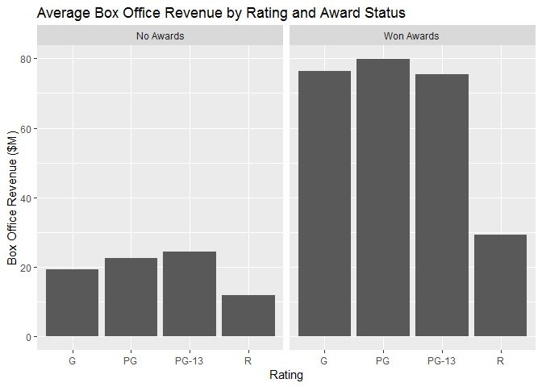
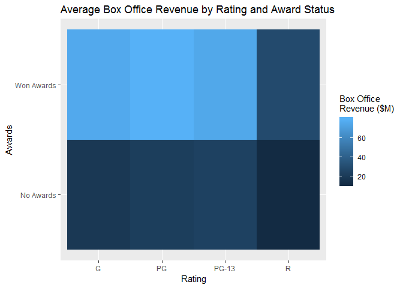

Trivariate Analysis for 2 Quantitative and 1 Qualitative variables
================

Charts
======

``` r
library(tidyverse)
```

    ## Warning: package 'tidyverse' was built under R version 3.5.2

    ## -- Attaching packages ------------------------------------------------------------------------ tidyverse 1.2.1 --

    ## v ggplot2 3.0.0     v purrr   0.2.5
    ## v tibble  1.4.2     v dplyr   0.7.6
    ## v tidyr   0.8.1     v stringr 1.3.1
    ## v readr   1.1.1     v forcats 0.3.0

    ## -- Conflicts --------------------------------------------------------------------------- tidyverse_conflicts() --
    ## x dplyr::filter() masks stats::filter()
    ## x dplyr::lag()    masks stats::lag()

``` r
movies <- read.csv("../data/movies.csv")
```

**Note: We could use the "same" code than previous exercise, using stat='identity'**, but we are following a different approach.

Grouped Bar Chart
-----------------

``` r
ggplot(
  data = movies,
  aes(x = Rating,
      y = Box.Office,
      fill = Awards)) +
  geom_bar(
    stat = "summary",
    fun.y = "mean",
    position = "dodge") +
  ggtitle("Average Box Office Revenue by Rating and Award Status") +
  xlab("Rating") +
  ylab("Box Office Revenue ($M)")
```



Stacked Bar Chart
-----------------

``` r
ggplot(
  data = movies,
  aes(x = Rating,
      y = Box.Office,
      fill = Awards)) +
  geom_bar(
    stat = "summary",
    fun.y = "mean",
    position = "stack") +
  ggtitle("Average Box Office Revenue by Rating and Award Status") +
  xlab("Rating") +
  ylab("Box Office Revenue ($M)")
```



Faceted Bar Chart
-----------------

``` r
ggplot(
  data = movies,
  aes(x = Rating,
      y = Box.Office)) +
  geom_bar(
    stat = "summary",
    fun.y = "mean",
    position = "stack") +
  ggtitle("Average Box Office Revenue by Rating and Award Status") +
  xlab("Rating") +
  ylab("Box Office Revenue ($M)") +
  facet_wrap(facets = ~Awards)
```



Heat Map
--------

``` r
table2 <- movies %>%
  select(Rating, Awards, Box.Office) %>%
  group_by(Rating, Awards) %>%
  summarize(Box.Office = mean(Box.Office))

table2 %>%
  ggplot(aes(x = Rating, y = Awards, fill= Box.Office)) +
  geom_tile(stat = "identity") +
  ggtitle("Average Box Office Revenue by Rating and Award Status") +
  xlab("Rating") +
  ylab("Awards") +
  labs(fill = "Box Office\nRevenue ($M)")
```


