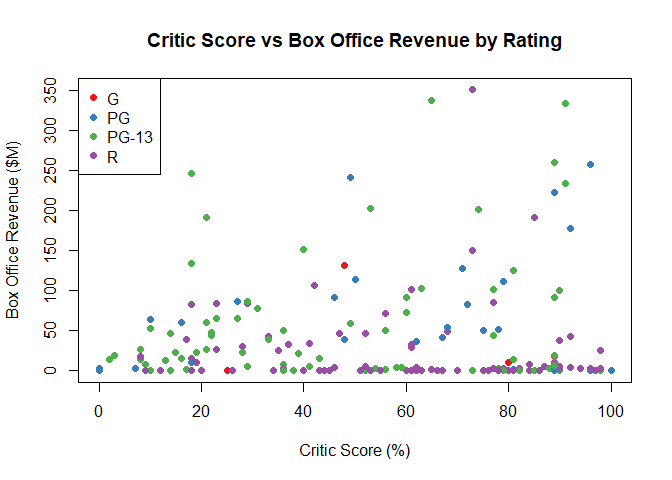
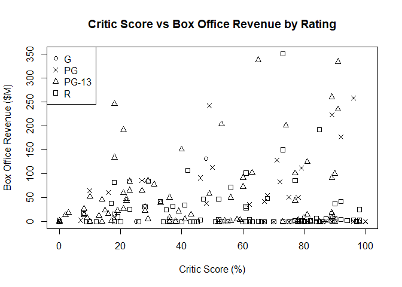
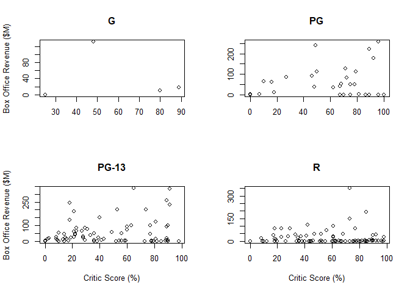
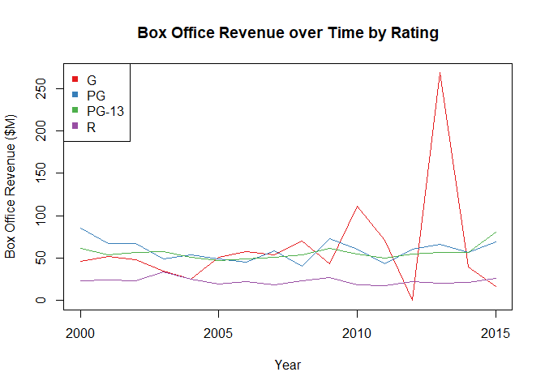
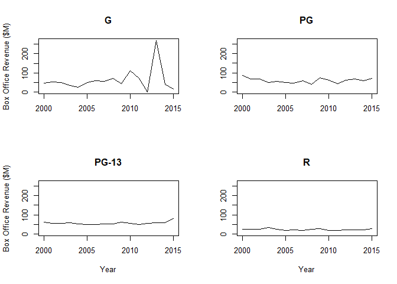

Trivariate Analysis for 1 Quantitative and 2 Qualitative variables
================

Charts
======

Setting up environment

``` r
library(RColorBrewer)
```

    ## Warning: package 'RColorBrewer' was built under R version 3.5.2

``` r
movies2014 <- read.csv("../data/movies.csv")
movies2014 <- movies2014[movies2014$Year == 2014,]

colors <- brewer.pal(4, "Set1")
```

Color-coded Scatterplot
-----------------------

``` r
plot(
  x = movies2014$Critic.Score,
  y = movies2014$Box.Office,
  col = colors[as.integer(movies2014$Rating)],
  pch = 19,
  main = "Critic Score vs Box Office Revenue by Rating",
  xlab ="Critic Score (%)",
  ylab = "Box Office Revenue ($M)")

# Add a legend
legend(x = "topleft",
       legend = levels(movies2014$Rating),
       col = colors[1:4],
       pch = 19)
```



Shaped-coded Scatterplot
------------------------

Creating a shape palette

``` r
shapes <- c(1,4,2,0)
```

``` r
plot(
  x = movies2014$Critic.Score,
  y = movies2014$Box.Office,
  pch = shapes[as.integer(movies2014$Rating)],
  main = "Critic Score vs Box Office Revenue by Rating",
  xlab ="Critic Score (%)",
  ylab = "Box Office Revenue ($M)")

# Add a legend
legend(x = "topleft",
       legend = levels(movies2014$Rating),
       pch = shapes)
```



Faceted Scatterplot
-------------------

We need to create the tables first

``` r
gMovies <- movies2014[movies2014$Rating == "G",]
pgMovies <- movies2014[movies2014$Rating == "PG",]
pg13Movies <- movies2014[movies2014$Rating == "PG-13",]
rMovies <- movies2014[movies2014$Rating == "R",]
```

``` r
par(mfrow = c(2,2))

plot(
  x = gMovies$Critic.Score,
  y = gMovies$Box.Office,
  main = "G",
  xlab = "",
  ylab = "Box Office Revenue ($M)")

plot(
  x = pgMovies$Critic.Score,
  y = pgMovies$Box.Office,
  main = "PG",
  xlab = "",
  ylab = "")

plot(
  x = pg13Movies$Critic.Score,
  y = pg13Movies$Box.Office,
  main = "PG-13",
  xlab = "Critic Score (%)",
  ylab = "Box Office Revenue ($M)")

plot(
  x = rMovies$Critic.Score,
  y = rMovies$Box.Office,
  main = "R",
  xlab = "Critic Score (%)",
  ylab = "")
```



Multi-series Line Chart
-----------------------

Setting up the dataset

``` r
timeSeries <- read.csv("../data/TimeSeries.csv")
head(timeSeries)
```

    ##   Year        G       PG     PG13        R
    ## 1 2000 46.13333 85.74286 61.24286 23.07253
    ## 2 2001 51.82000 66.84118 54.15153 24.48450
    ## 3 2002 48.45000 67.62500 56.59665 23.52896
    ## 4 2003 34.31667 49.37539 57.77350 33.98456
    ## 5 2004 24.85000 54.30493 51.19265 24.96031
    ## 6 2005 50.60000 49.02735 47.63012 19.35382

``` r
plot(
  x = 0,
  y = 0,
  xlim = c(2000,2015),
  ylim = c(0, max(timeSeries$G)),
  type = "l",
  main = "Box Office Revenue over Time by Rating",
  xlab = "Year",
  ylab = "Box Office Revenue ($M)")

lines(
  x = timeSeries$Year,
  y = timeSeries$G,
  col = colors[1])

lines(
  x = timeSeries$Year,
  y = timeSeries$PG,
  col = colors[2])

lines(
  x = timeSeries$Year,
  y = timeSeries$PG13,
  col = colors[3])

lines(
  x = timeSeries$Year,
  y = timeSeries$R,
  col = colors[4])

legend(
  x = "topleft",
  legend = c("G","PG","PG-13","R"),
  col = colors,
  pch = 15)
```



Stacked Area Chart
------------------

**Stacked Area chart is a bit difficult on the base chart control, so we are doing it on GGPlot**

Faceted Line Chart
------------------

``` r
par(mfrow = c(2,2))
ymax <-  max(timeSeries$G)
plot(
  x = timeSeries[,c(1,2)],
  type = "l",
  main = "G",
  xlab = "",
  ylab = "Box Office Revenue ($M)")

plot(
  x = timeSeries[,c(1,3)],
  type = "l",
  main = "PG",
  xlab = "",
  ylab = "",
  ylim = c(0, ymax))

plot(
  x = timeSeries[,c(1,4)],
  type = "l",
  main = "PG-13",
  xlab = "Year",
  ylab = "Box Office Revenue ($M)",
  ylim = c(0,ymax))

plot(
  x = timeSeries[,c(1,5)],
  type = "l",
  main = "R",
  xlab = "Year",
  ylab = "",
  ylim = c(0,ymax))
```


