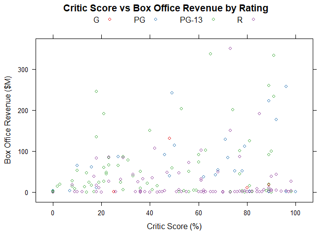
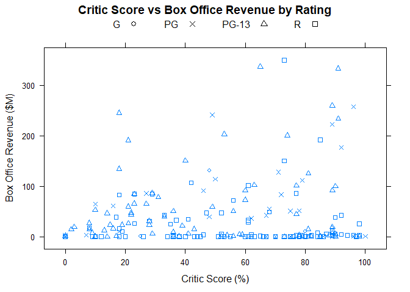
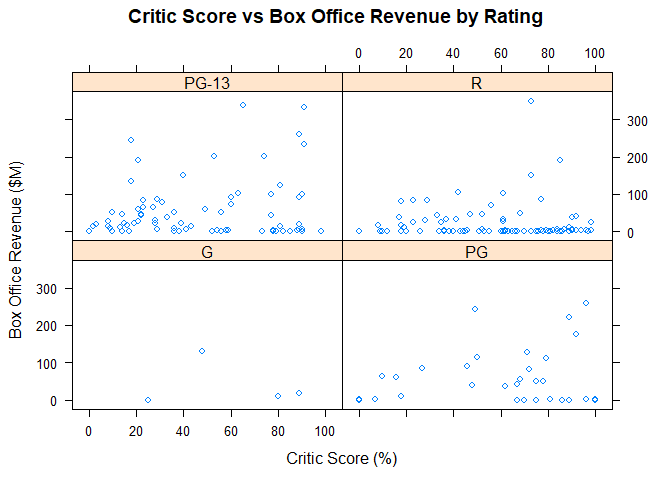
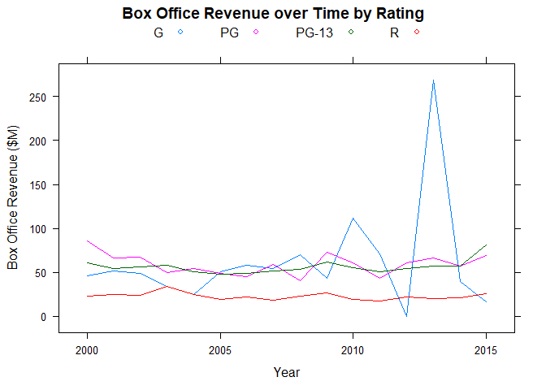
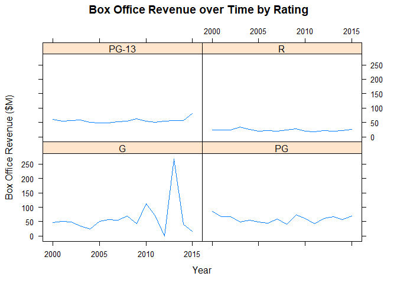

Trivariate Analysis for 1 Quantitative and 2 Qualitative variables
================

Charts
======

Setting up environment

``` r
library(lattice)
library(RColorBrewer)
```

    ## Warning: package 'RColorBrewer' was built under R version 3.5.2

``` r
library(tidyverse)
```

    ## Warning: package 'tidyverse' was built under R version 3.5.2

    ## -- Attaching packages ---------------------------------------------------------------------------------------------------------------------------------- tidyverse 1.2.1 --

    ## v ggplot2 3.1.0       v purrr   0.3.0  
    ## v tibble  2.0.1       v dplyr   0.8.0.1
    ## v tidyr   0.8.2       v stringr 1.4.0  
    ## v readr   1.3.1       v forcats 0.4.0

    ## Warning: package 'ggplot2' was built under R version 3.5.2

    ## Warning: package 'tibble' was built under R version 3.5.2

    ## Warning: package 'tidyr' was built under R version 3.5.2

    ## Warning: package 'readr' was built under R version 3.5.2

    ## Warning: package 'purrr' was built under R version 3.5.2

    ## Warning: package 'dplyr' was built under R version 3.5.2

    ## Warning: package 'stringr' was built under R version 3.5.2

    ## Warning: package 'forcats' was built under R version 3.5.2

    ## -- Conflicts ------------------------------------------------------------------------------------------------------------------------------------- tidyverse_conflicts() --
    ## x dplyr::filter() masks stats::filter()
    ## x dplyr::lag()    masks stats::lag()

``` r
colors <- brewer.pal(4, "Set1")
shapes <- c(1,4,2,0)
movies <- read.csv("../data/movies.csv")
movies2014 <- movies[movies$Year == 2014,]
```

Color-coded Scatterplot
-----------------------

``` r
movies2014 %>%
xyplot(
  x = Box.Office ~ Critic.Score,
  group = Rating,
  par.settings = list(
    superpose.symbol = list(
      col = colors)),
  auto.key = list(columns = 4),
  main = "Critic Score vs Box Office Revenue by Rating",
  xlab = "Critic Score (%)",
  ylab = "Box Office Revenue ($M)")
```



Shaped-coded Scatterplot
------------------------

``` r
movies2014 %>%
xyplot(
  x = Box.Office ~ Critic.Score,
  key = list(
    text = list(
      levels(movies2014$Rating)),
    points = list(
      pch = shapes),
    columns = 4),
  pch = shapes[as.integer(movies2014$Rating)],
  main = "Critic Score vs Box Office Revenue by Rating",
  xlab = "Critic Score (%)",
  ylab = "Box Office Revenue ($M)")
```



Faceted Scatterplot
-------------------

``` r
movies2014 %>%
  xyplot(
    x = Box.Office ~ Critic.Score | Rating,
    main = "Critic Score vs Box Office Revenue by Rating",
    xlab = "Critic Score (%)",
    ylab = "Box Office Revenue ($M)")
```



Multi-series Line Chart
-----------------------

Setting up environment

``` r
timeSeries2 <- movies %>%
  select(Year, Rating, Box.Office) %>%
  group_by(Year, Rating) %>%
  summarize(Box.Office = mean(Box.Office)) %>%
  as.data.frame()
head(timeSeries2)
```

    ##   Year Rating Box.Office
    ## 1 2000      G   46.13333
    ## 2 2000     PG   85.74286
    ## 3 2000  PG-13   61.24286
    ## 4 2000      R   23.07253
    ## 5 2001      G   51.82000
    ## 6 2001     PG   66.84118

Plotting

``` r
xyplot(
  x = Box.Office ~ Year,
  data = timeSeries2,
  groups =  Rating,
  type = "l",
  auto.key = list(columns = 4),
  main = "Box Office Revenue over Time by Rating",
  xlab = "Year",
  ylab = "Box Office Revenue ($M)")
```



Stacked Area Chart
------------------

**Stacked Area chart is a bit difficult on the base chart control, so we are doing it on GGPlot**

Faceted Line Chart
------------------

``` r
xyplot(
  x = Box.Office ~ Year | Rating,
  data = timeSeries2,
  type = "l",
  layout = c(2,2),
  main = "Box Office Revenue over Time by Rating",
  xlab = "Year",
  ylab = "Box Office Revenue ($M)")
```


