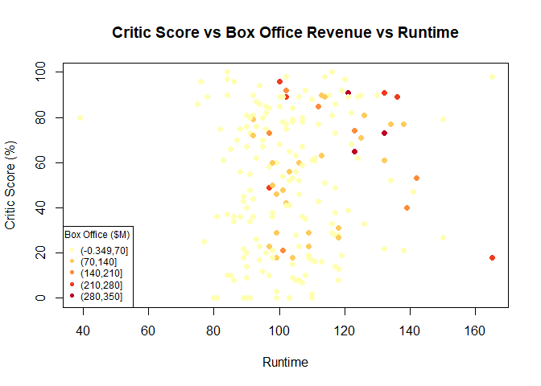
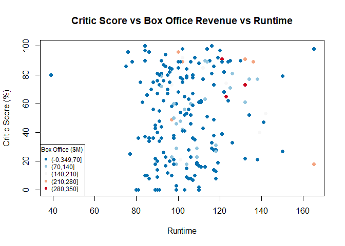
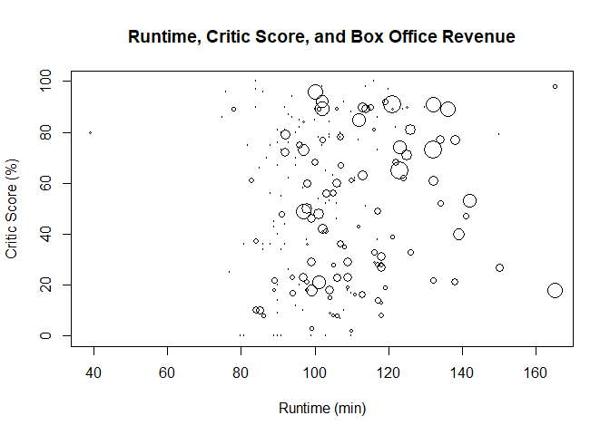
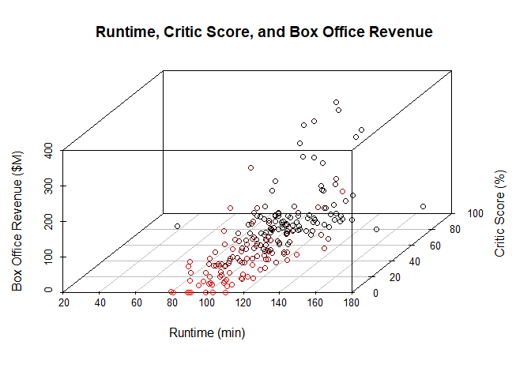

Trivariate Quantitative Analysis
================

Trivariate Quantitative Analysis
================================

Setting up environment

``` r
library(tidyverse)
```

    ## Warning: package 'tidyverse' was built under R version 3.5.2

    ## -- Attaching packages --------------------------------------- tidyverse 1.2.1 --

    ## v ggplot2 3.1.0       v purrr   0.3.0  
    ## v tibble  2.0.1       v dplyr   0.8.0.1
    ## v tidyr   0.8.2       v stringr 1.4.0  
    ## v readr   1.3.1       v forcats 0.4.0

    ## Warning: package 'ggplot2' was built under R version 3.5.2

    ## Warning: package 'tibble' was built under R version 3.5.2

    ## Warning: package 'tidyr' was built under R version 3.5.2

    ## Warning: package 'readr' was built under R version 3.5.2

    ## Warning: package 'purrr' was built under R version 3.5.2

    ## Warning: package 'dplyr' was built under R version 3.5.2

    ## Warning: package 'stringr' was built under R version 3.5.2

    ## Warning: package 'forcats' was built under R version 3.5.2

    ## -- Conflicts ------------------------------------------ tidyverse_conflicts() --
    ## x dplyr::filter() masks stats::filter()
    ## x dplyr::lag()    masks stats::lag()

``` r
library(RColorBrewer)
```

    ## Warning: package 'RColorBrewer' was built under R version 3.5.2

``` r
library(scatterplot3d)
```

    ## Warning: package 'scatterplot3d' was built under R version 3.5.2

``` r
gradient <- brewer.pal(5, "YlOrRd")
palette(gradient)
movies <- read.csv("../data/movies.csv")
movies2014 <- movies[movies$Year == 2014,]
```

Chart and Plots
===============

Gradient Color-scale Scatterplot
--------------------------------

``` r
plot(
   x = movies2014$Runtime,
   y = movies2014$Critic.Score,
   col = cut(movies2014$Box.Office, 5),
   pch = 16,
   main = "Critic Score vs Box Office Revenue vs Runtime",
   xlab = "Runtime",
   ylab = "Critic Score (%)")

legend(
  x = "bottomleft",
  title = "Box Office ($M)",
  legend = levels(cut(movies2014$Box.Office,5)),
  col = 1:5,
  pch = 16,
  cex = 0.75)
```



Divergent Color-scale Scatterplot
---------------------------------

``` r
divergent <- rev(brewer.pal(5,"RdBu"))
palette(divergent)

plot(
   x = movies2014$Runtime,
   y = movies2014$Critic.Score,
   col = cut(movies2014$Box.Office, 5),
   pch = 16,
   main = "Critic Score vs Box Office Revenue vs Runtime",
   xlab = "Runtime",
   ylab = "Critic Score (%)")

legend(
  x = "bottomleft",
  title = "Box Office ($M)",
  legend = levels(cut(movies2014$Box.Office,5)),
  col = 1:5,
  pch = 16,
  cex = 0.75)
```



Reset the palette

``` r
palette("default")
```

Bubble Chart
------------

Setting up environment

``` r
getSize <- function(values, scale){
  ratio <- values / max(values)
  size <- sqrt(ratio/pi)
  size * scale
}
```

``` r
plot(
  x = movies2014$Runtime,
  y = movies2014$Critic.Score,
  cex = getSize(movies2014$Box.Office, 5),
  main = "Runtime, Critic Score, and Box Office Revenue",
  xlab = "Runtime (min)",
  ylab = "Critic Score (%)")
```



3D Scatterplot
--------------

``` r
scatterplot3d(
  x = movies2014$Runtime,
  y = movies2014$Critic.Score,
  z = movies2014$Box.Office,
  main = "Runtime, Critic Score, and Box Office Revenue",
  xlab = "Runtime (min)",
  ylab = "Critic Score (%)",
  zlab = "Box Office Revenue ($M)",
  highlight.3d = TRUE)
```


