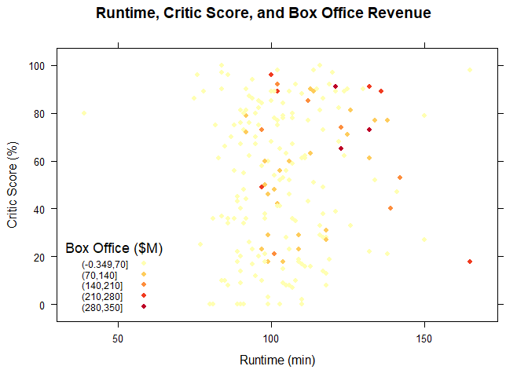
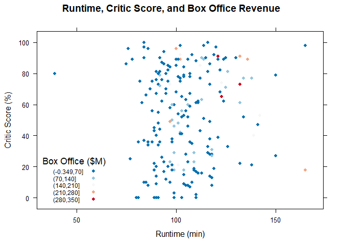
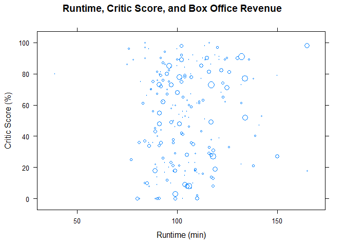
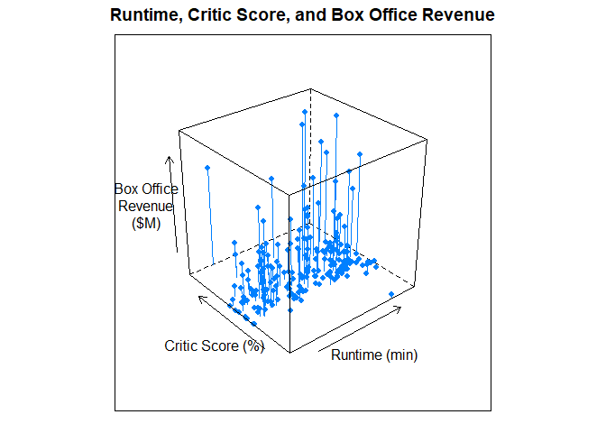

Trivariate Quantitative Analysis
================

Trivariate Quantitative Analysis
================================

Setting up environment

``` r
library(tidyverse)
```

    ## Warning: package 'tidyverse' was built under R version 3.5.2

    ## -- Attaching packages ---------------------------------------------------------------------------------------------------------------------------------- tidyverse 1.2.1 --

    ## v ggplot2 3.1.0       v purrr   0.3.0  
    ## v tibble  2.0.1       v dplyr   0.8.0.1
    ## v tidyr   0.8.2       v stringr 1.4.0  
    ## v readr   1.3.1       v forcats 0.4.0

    ## Warning: package 'ggplot2' was built under R version 3.5.2

    ## Warning: package 'tibble' was built under R version 3.5.2

    ## Warning: package 'tidyr' was built under R version 3.5.2

    ## Warning: package 'readr' was built under R version 3.5.2

    ## Warning: package 'purrr' was built under R version 3.5.2

    ## Warning: package 'dplyr' was built under R version 3.5.2

    ## Warning: package 'stringr' was built under R version 3.5.2

    ## Warning: package 'forcats' was built under R version 3.5.2

    ## -- Conflicts ------------------------------------------------------------------------------------------------------------------------------------- tidyverse_conflicts() --
    ## x dplyr::filter() masks stats::filter()
    ## x dplyr::lag()    masks stats::lag()

``` r
library(RColorBrewer)
```

    ## Warning: package 'RColorBrewer' was built under R version 3.5.2

``` r
library(lattice)
gradient <- brewer.pal(5, "YlOrRd")
palette(gradient)
movies <- read.csv("../data/movies.csv")
movies2014 <- movies[movies$Year == 2014,]
```

Chart and Plots
===============

Gradient Color-scale Scatterplot
--------------------------------

``` r
  xyplot(
    data = movies2014,
    x = Critic.Score ~ Runtime,
    col = gradient[cut(movies2014$Box.Office, 5)],
    pch = 16,
    main = "Runtime, Critic Score, and Box Office Revenue",
    xlab = "Runtime (min)",
    ylab = "Critic Score (%)",
    key = list(
      corner = c(0.05,0.05),
      title = "Box Office ($M)",
      cex = 0.75,
      text = list(levels(cut(movies2014$Box.Office,5))),
      points = list(
        pch = 16,
        col = gradient)))
```



Divergent Color-scale Scatterplot
---------------------------------

``` r
divergent <- rev(brewer.pal(5,"RdBu"))
palette(divergent)

xyplot(
    data = movies2014,
    x = Critic.Score ~ Runtime,
    col = divergent[cut(movies2014$Box.Office, 5)],
    pch = 16,
    main = "Runtime, Critic Score, and Box Office Revenue",
    xlab = "Runtime (min)",
    ylab = "Critic Score (%)",
    key = list(
      corner = c(0.05,0.05),
      title = "Box Office ($M)",
      cex = 0.75,
      text = list(levels(cut(movies2014$Box.Office,5))),
      points = list(
        pch = 16,
        col = divergent)))
```



Bubble Chart
------------

Setting up environment

``` r
getSize <- function(values, scale){
  ratio <- values / max(values)
  size <- sqrt(ratio/pi)
  size * scale
}
```

``` r
xyplot(
  data = movies2014,
  x = Critic.Score ~ Runtime,
  cex = getSize(movies$Box.Office,5),
  main = "Runtime, Critic Score, and Box Office Revenue",
  xlab = "Runtime (min)",
  ylab = "Critic Score (%)")
```



3D Scatterplot
--------------

``` r
cloud(
  x = Box.Office ~ Critic.Score * Runtime,
  data = movies2014,
  type = c("p","h"), # point and histagram
  pch = 16,
  main = "Runtime, Critic Score, and Box Office Revenue",
  xlab = "Runtime (min)",
  ylab = "Critic Score (%)",
  zlab = "Box Office\nRevenue\n($M)")
```


