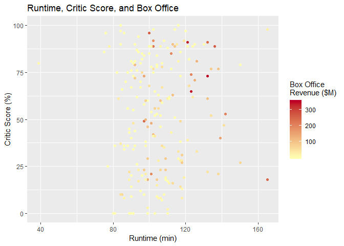
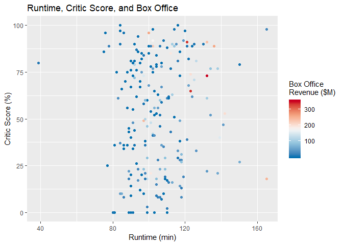
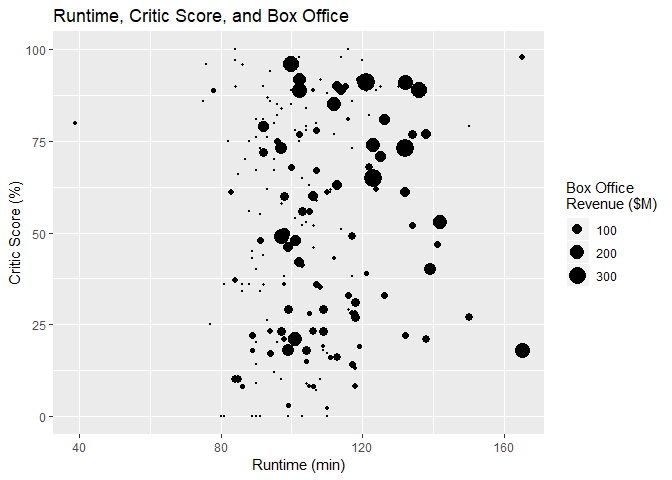

Trivariate Quantitative Analysis
================

Trivariate Quantitative Analysis
================================

Setting up environment

``` r
library(tidyverse)
```

    ## Warning: package 'tidyverse' was built under R version 3.5.2

    ## -- Attaching packages ---------------------------------------------------------------------------------------------------------------------------------- tidyverse 1.2.1 --

    ## v ggplot2 3.1.0       v purrr   0.3.0  
    ## v tibble  2.0.1       v dplyr   0.8.0.1
    ## v tidyr   0.8.2       v stringr 1.4.0  
    ## v readr   1.3.1       v forcats 0.4.0

    ## Warning: package 'ggplot2' was built under R version 3.5.2

    ## Warning: package 'tibble' was built under R version 3.5.2

    ## Warning: package 'tidyr' was built under R version 3.5.2

    ## Warning: package 'readr' was built under R version 3.5.2

    ## Warning: package 'purrr' was built under R version 3.5.2

    ## Warning: package 'dplyr' was built under R version 3.5.2

    ## Warning: package 'stringr' was built under R version 3.5.2

    ## Warning: package 'forcats' was built under R version 3.5.2

    ## -- Conflicts ------------------------------------------------------------------------------------------------------------------------------------- tidyverse_conflicts() --
    ## x dplyr::filter() masks stats::filter()
    ## x dplyr::lag()    masks stats::lag()

``` r
library(RColorBrewer)
```

    ## Warning: package 'RColorBrewer' was built under R version 3.5.2

``` r
gradient <- brewer.pal(5, "YlOrRd")
palette(gradient)
movies <- read.csv("../data/movies.csv")
movies2014 <- movies[movies$Year == 2014,]
```

Chart and Plots
===============

Gradient Color-scale Scatterplot
--------------------------------

``` r
movies2014 %>%
  ggplot(
    aes(x = Runtime,
        y = Critic.Score,
        color = Box.Office)) +
  geom_point() +
  scale_color_gradient(
    low = gradient[1],
    high = gradient[5]) +
  ggtitle("Runtime, Critic Score, and Box Office") +
  xlab("Runtime (min)") +
  ylab("Critic Score (%)") +
  labs(color = "Box Office\nRevenue ($M)")
```



Divergent Color-scale Scatterplot
---------------------------------

``` r
divergent <- rev(brewer.pal(5,"RdBu"))
palette(divergent)

movies2014 %>%
  ggplot(
    aes(x = Runtime,
        y = Critic.Score,
        color = Box.Office)) +
  geom_point() +
  scale_color_gradientn(
    colors = divergent) +
  ggtitle("Runtime, Critic Score, and Box Office") +
  xlab("Runtime (min)") +
  ylab("Critic Score (%)") +
  labs(color = "Box Office\nRevenue ($M)")
```



Bubble Chart
------------

``` r
 movies2014 %>%
  ggplot(
    aes(x = Runtime,
        y = Critic.Score,
        size = Box.Office, 10)) +
  geom_point() +
  scale_size_area() +
  ggtitle("Runtime, Critic Score, and Box Office") +
  xlab("Runtime (min)") +
  ylab("Critic Score (%)") +
  labs(size = "Box Office\nRevenue ($M)")
```



3D Scatterplot
--------------

\*\* Not available on GGPlot\*\*
