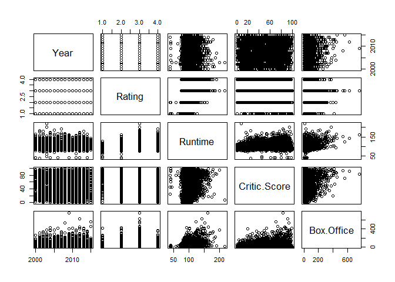
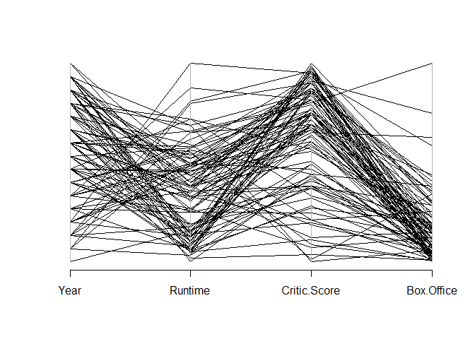

Multivariate Analysis
================

Multivariate Analysis
=====================

Charts / Plots
==============

Setting up environment

``` r
library(corrgram)
```

    ## Warning: package 'corrgram' was built under R version 3.5.3

``` r
movies <- read.csv("../data/movies.csv")

# Creates a correlation matrix
correlations <- cor(movies[,c(2,4,5,6)])

round(correlations,2)
```

    ##               Year Runtime Critic.Score Box.Office
    ## Year          1.00   -0.04         0.04      -0.01
    ## Runtime      -0.04    1.00         0.19       0.35
    ## Critic.Score  0.04    0.19         1.00       0.16
    ## Box.Office   -0.01    0.35         0.16       1.00

Correlogram
-----------

``` r
corrgram(movies)
```


Scatterplot Matrix
------------------

``` r
plot(movies[,2:6])
```



Parallel Coordinates Plot
-------------------------

Load top 100 movies

``` r
top100 <- read.csv("../data/Top 100.csv")
head(top100)
```

    ##                     Title Year Rating Runtime Critic.Score Box.Office
    ## 1                  Avatar 2009  PG-13     162           83      760.5
    ## 2            The Avengers 2012  PG-13     143           92      623.3
    ## 3          Jurassic World 2015  PG-13     124           71      556.5
    ## 4         The Dark Knight 2008  PG-13     152           94      533.3
    ## 5 Avengers: Age of Ultron 2015  PG-13     141           74      454.2
    ## 6   The Dark Knight Rises 2012  PG-13     165           87      448.1
    ##       Awards  Distribution
    ## 1 Won Awards International
    ## 2 Won Awards      Domestic
    ## 3  No Awards International
    ## 4 Won Awards International
    ## 5  No Awards      Domestic
    ## 6 Won Awards International

Load MASS package

``` r
library(MASS)
parcoord(top100[,c(2,4,5,6)])
```


