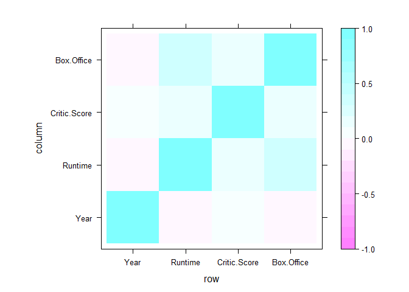
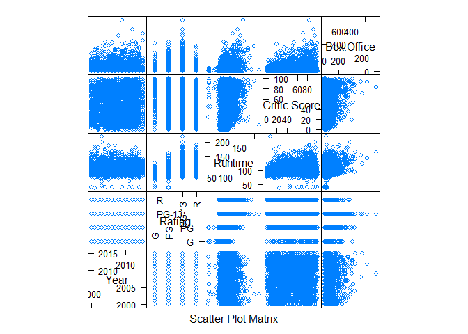
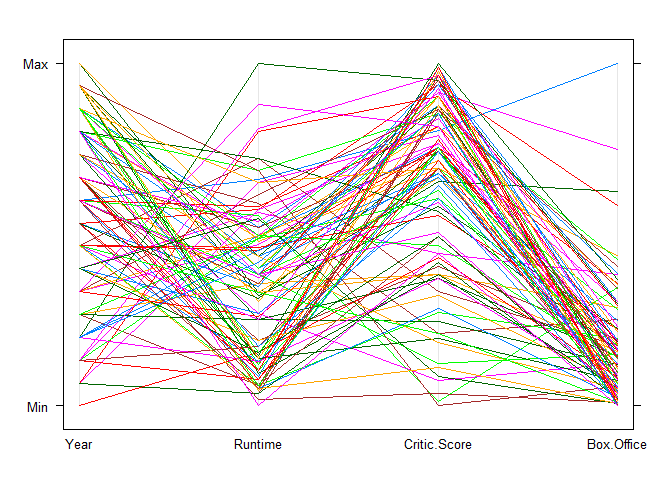

Multivariate Analysis
================

Multivariate Analysis
=====================

Charts / Plots
==============

Setting up environment

``` r
library(corrgram)
```

    ## Warning: package 'corrgram' was built under R version 3.5.3

``` r
library(lattice)
```

    ## 
    ## Attaching package: 'lattice'

    ## The following object is masked from 'package:corrgram':
    ## 
    ##     panel.fill

``` r
movies <- read.csv("../data/movies.csv")
top100 <- read.csv("../data/Top 100.csv")
# Creates a correlation matrix
correlations <- cor(movies[,c(2,4,5,6)])

round(correlations,2)
```

    ##               Year Runtime Critic.Score Box.Office
    ## Year          1.00   -0.04         0.04      -0.01
    ## Runtime      -0.04    1.00         0.19       0.35
    ## Critic.Score  0.04    0.19         1.00       0.16
    ## Box.Office   -0.01    0.35         0.16       1.00

Correlogram
-----------

``` r
levelplot(
  x = correlations,
  at = seq(-1,1,0.1))
```



Scatterplot Matrix
------------------

``` r
splom(movies[,c(2:6)])
```



Parallel Coordinates Plot
-------------------------

``` r
parallelplot(
  x = top100[,c(2,4,5,6)],
  horizontal.axis = FALSE)
```


