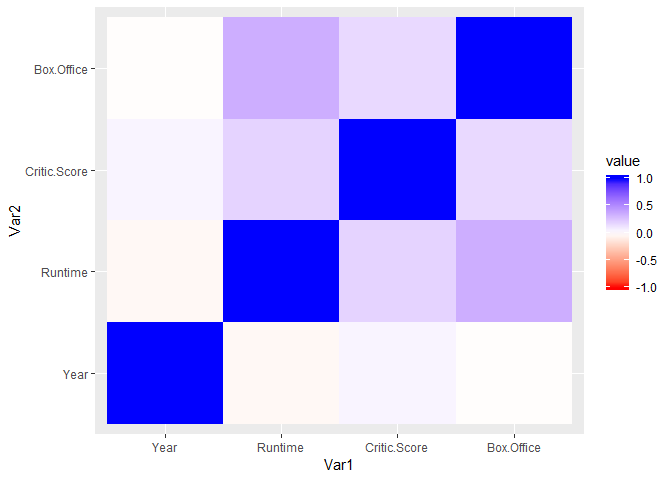
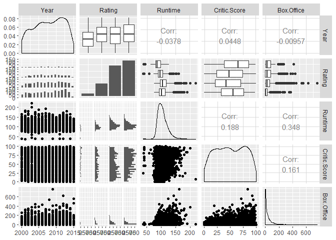
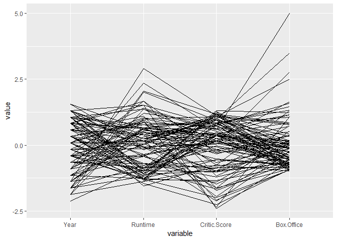

Multivariate Analysis
================

Multivariate Analysis
=====================

Setting up environment

``` r
library(corrgram)
```

    ## Warning: package 'corrgram' was built under R version 3.5.3

``` r
library(ggplot2)
```

    ## Warning: package 'ggplot2' was built under R version 3.5.2

``` r
library(reshape2)
```

    ## Warning: package 'reshape2' was built under R version 3.5.2

``` r
movies <- read.csv("../data/movies.csv")
top100 <- read.csv("../data/Top 100.csv")

# Creates a correlation matrix
correlations <- cor(movies[,c(2,4,5,6)])
melted <- melt(correlations) # Convert it to DF
round(correlations,2)
```

    ##               Year Runtime Critic.Score Box.Office
    ## Year          1.00   -0.04         0.04      -0.01
    ## Runtime      -0.04    1.00         0.19       0.35
    ## Critic.Score  0.04    0.19         1.00       0.16
    ## Box.Office   -0.01    0.35         0.16       1.00

``` r
head(melted)
```

    ##           Var1    Var2        value
    ## 1         Year    Year  1.000000000
    ## 2      Runtime    Year -0.037811720
    ## 3 Critic.Score    Year  0.044763131
    ## 4   Box.Office    Year -0.009573985
    ## 5         Year Runtime -0.037811720
    ## 6      Runtime Runtime  1.000000000

Charts / Plots
==============

Correlogram
-----------

``` r
ggplot(
  data = melted,
  aes(
    x = Var1,
    y = Var2,
    fill = value)) +
  geom_tile() +
  scale_fill_gradient2(
    low = "red",
    mid = "white",
    high = "blue",
    limit = c(-1,1),
    midpoint = 0)
```



Scatterplot Matrix
------------------

``` r
library(GGally)
```

    ## Warning: package 'GGally' was built under R version 3.5.3

``` r
ggpairs(
  data = movies,
  columns = c(2:6))
```

    ## `stat_bin()` using `bins = 30`. Pick better value with `binwidth`.
    ## `stat_bin()` using `bins = 30`. Pick better value with `binwidth`.
    ## `stat_bin()` using `bins = 30`. Pick better value with `binwidth`.
    ## `stat_bin()` using `bins = 30`. Pick better value with `binwidth`.



Parallel Coordinates Plot
-------------------------

``` r
ggparcoord(top100,c(2,4,5,6))
```


