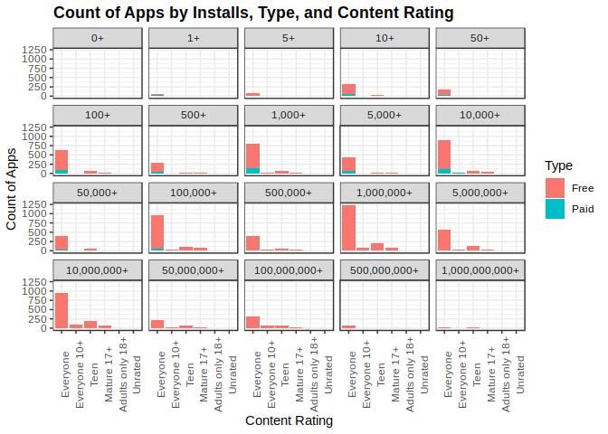

Qualitative Trivariate Analysis
================

Setup Environment
=================

From the previous course I created the rda file for the Google Play App, also in there is the data wrangling process and original source from kaggle.com, if you want to see where the data is coming from and how it was transformed, you can take a look at [here](https://github.com/irmoralesb/BeginningDataVisualizationWithR).

Quantitative Variables

    * Ratings
    * Reviews
    * Size (Numeric)
    * Price

Qualitative Variables

    * Category
    * Installs (Install range)
    * Type (Free/Paid)
    * Content Rating
    * Genre

We are to display the relationship between:

    * Installs, Type and Content Rating.

``` r
library(tidyverse)
```

    ## ── Attaching packages ─────────────────────────────────────────────────────────────────────────── tidyverse 1.2.1 ──

    ## ✔ ggplot2 3.1.0     ✔ purrr   0.3.0
    ## ✔ tibble  2.0.1     ✔ dplyr   0.7.8
    ## ✔ tidyr   0.8.2     ✔ stringr 1.4.0
    ## ✔ readr   1.3.1     ✔ forcats 0.3.0

    ## ── Conflicts ────────────────────────────────────────────────────────────────────────────── tidyverse_conflicts() ──
    ## ✖ dplyr::filter() masks stats::filter()
    ## ✖ dplyr::lag()    masks stats::lag()

``` r
library(dslabs)
ds_theme_set()

load("rda/apps_versions_dataset.rda")
```

Charts/Plots
============

Faceted Grouped Frequency Bar Chart
-----------------------------------

``` r
apps_versions_dataset %>%
  ggplot(aes(
    x = Installs, fill = Type)) +
  geom_bar(position = "dodge") +
  facet_wrap(
    facets = ~Content.Rating) +
  ggtitle("Count of Apps by Installs, Type, and Content Rating")+
  xlab("Installs") +
  ylab("Count of Apps") + 
  theme(
    axis.text.x = element_text(angle = 90))
```


we also could show the data this way, but is more clear the first one.

``` r
apps_versions_dataset %>%
  ggplot(aes(
    x = Content.Rating, fill = Type)) +
  geom_bar(position = "dodge") +
  facet_wrap(
    facets = ~Installs) +
  ggtitle("Count of Apps by Installs, Type, and Content Rating")+
  xlab("Content Rating") +
  ylab("Count of Apps") + 
  theme(
    axis.text.x = element_text(angle = 90))
```


Faceted Stacked Frequency Bar Chart
-----------------------------------

``` r
apps_versions_dataset %>% 
  ggplot(aes(
    x = Installs,
    fill = Type)) +
  geom_bar(
    position = "stack") +
  facet_wrap(
    facets = ~Content.Rating) +
  ggtitle("Count of Apps by Installs, Type, and Content Rating")+
  xlab("Installs") +
  ylab("Count of Apps") + 
  theme(
    axis.text.x = element_text(angle = 90))
```


``` r
apps_versions_dataset %>%
  ggplot(
    aes(
      x = Content.Rating,
      fill = Type)) +
  geom_bar( position =  "stack") +
  facet_wrap(facets = ~Installs) +
  ggtitle("Count of Apps by Installs, Type, and Content Rating")+
  xlab("Content Rating") +
  ylab("Count of Apps") + 
  theme(
    axis.text.x = element_text(angle = 90))
```



Faceted Frequency Bar Chart
---------------------------

``` r
apps_versions_dataset %>%
  ggplot(aes(
    x = Installs
  )) +
  geom_bar() +
  facet_grid(
    facets = Type~Content.Rating) +
  ggtitle("Count of Apps by Installs, Type, and Content Rating") +
  xlab("Installs") +
  ylab("Count of Apps") + 
  theme(
    axis.text.x = element_text(angle = 90))
```


