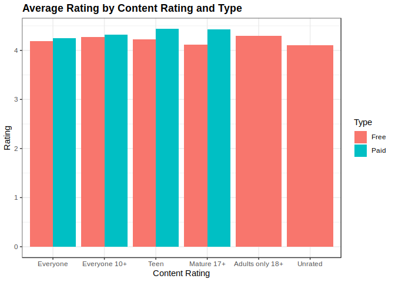
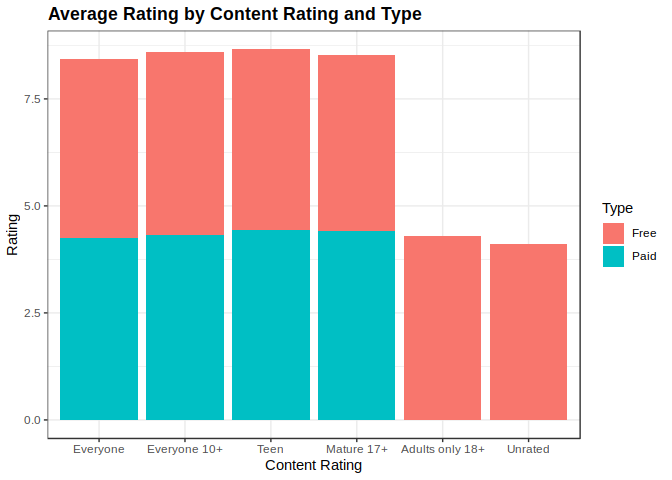
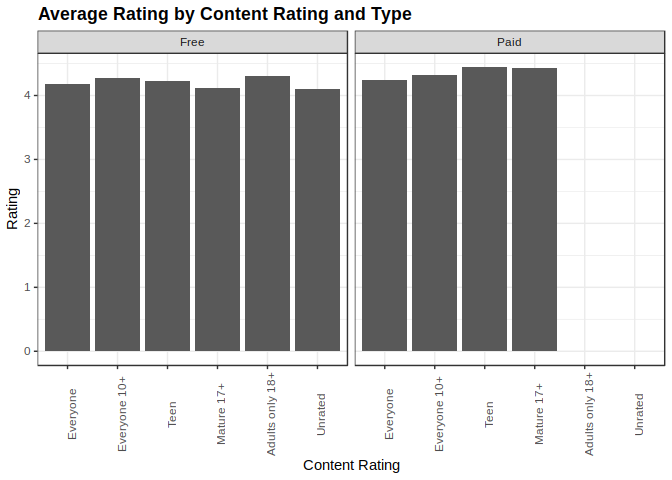
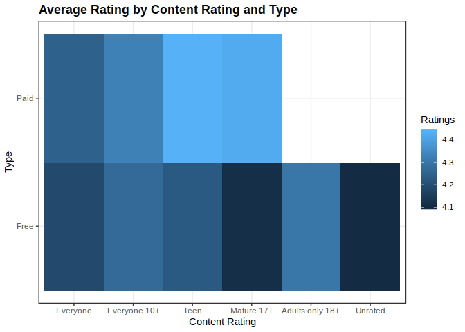

Trivariate Analysis - 2 Qualitative & 1 Quantitative
================

Setup Environment
=================

From the previous course I created the rda file for the Google Play App, also in there is the data wrangling process and original source from kaggle.com, if you want to see where the data is coming from and how it was transformed, you can take a look at [here](https://github.com/irmoralesb/BeginningDataVisualizationWithR).

Quantitative Variables

    * Ratings
    * Reviews
    * Size (Numeric)
    * Price

Qualitative Variables

    * Category
    * Installs (Install range)
    * Type (Free/Paid)
    * Content Rating
    * Genre

We are to display the relationship between:

    * Type, Content Rating, and Ratings.

``` r
library(tidyverse)
```

    ## ── Attaching packages ─────────────────────────────────────────────────────────────────────────── tidyverse 1.2.1 ──

    ## ✔ ggplot2 3.1.0     ✔ purrr   0.3.0
    ## ✔ tibble  2.0.1     ✔ dplyr   0.7.8
    ## ✔ tidyr   0.8.2     ✔ stringr 1.4.0
    ## ✔ readr   1.3.1     ✔ forcats 0.3.0

    ## ── Conflicts ────────────────────────────────────────────────────────────────────────────── tidyverse_conflicts() ──
    ## ✖ dplyr::filter() masks stats::filter()
    ## ✖ dplyr::lag()    masks stats::lag()

``` r
library(dslabs)
ds_theme_set()

load("rda/apps_versions_dataset.rda")
```

Charts/Plots
============

Grouped Bar Chart
-----------------

``` r
apps_versions_dataset %>%
  filter(!is.na(Rating)) %>%
  ggplot(aes(
    x = Content.Rating,
    y = Rating,
    fill = Type)) +
  geom_bar( 
    stat = "summary",
    fun.y = "mean",
    position = "dodge")+
  ggtitle("Average Rating by Content Rating and Type") +
  xlab("Content Rating")  +
  ylab("Rating")
```



Stacked Bar Chart
-----------------

``` r
apps_versions_dataset %>%
  filter(!is.na(Rating)) %>%
  ggplot(aes(
    x = Content.Rating,
    y = Rating,
    fill = Type)) +
  geom_bar(
    position = "stack",
    stat = "summary",
    fun.y = "mean") +
  ggtitle("Average Rating by Content Rating and Type") +
  xlab("Content Rating")  +
  ylab("Rating")
```



Faceted Bar Chart
-----------------

``` r
apps_versions_dataset %>%
  filter(!is.na(Rating)) %>%
  ggplot(aes(
    x = Content.Rating,
    y = Rating)) +
  geom_bar(
    stat = "summary",
    fun.y = "mean",
    position = "stack") +
  facet_wrap(
    facets = ~Type) +
  ggtitle("Average Rating by Content Rating and Type") +
  xlab("Content Rating")  +
  ylab("Rating") +
  theme(
    axis.text.x = element_text(angle = 90))
```



Heat Map
--------

``` r
apps_table <-apps_versions_dataset %>%
  filter(!is.na(Rating)) %>%
  select(Content.Rating, Type, Rating) %>%
  group_by(Content.Rating,Type) %>%
  summarize(Rating = mean(Rating))

apps_table %>%
  ggplot(aes(
    x = Content.Rating, 
    y = Type, 
    fill = Rating)) +
  geom_tile(stat = "identity") +
  ggtitle ("Average Rating by Content Rating and Type") +
  xlab("Content Rating") +
  ylab("Type") +
  labs(fill = "Ratings")
```


