Trivariate Analysis - 1 Qualitative & 2 Quantitative
================

Setup Environment
=================

From the previous course I created the rda file for the Google Play App, also in there is the data wrangling process and original source from kaggle.com, if you want to see where the data is coming from and how it was transformed, you can take a look at [here](https://github.com/irmoralesb/BeginningDataVisualizationWithR).

Quantitative Variables

    * Ratings
    * Reviews
    * Size (Numeric)
    * Price

Qualitative Variables

    * Category
    * Installs (Install range)
    * Type (Free/Paid)
    * Content Rating
    * Genre

We are to display the relationship between:

    * Type, Ratings & Reviews.
    * Content Rating, Ratings & Reviews.

``` r
library(tidyverse)
```

    ## ── Attaching packages ────────────────────────────────────────────────────────────────────────────────────────────────────────────────────────────── tidyverse 1.2.1 ──

    ## ✔ ggplot2 3.1.0     ✔ purrr   0.3.0
    ## ✔ tibble  2.0.1     ✔ dplyr   0.7.8
    ## ✔ tidyr   0.8.2     ✔ stringr 1.4.0
    ## ✔ readr   1.3.1     ✔ forcats 0.3.0

    ## ── Conflicts ───────────────────────────────────────────────────────────────────────────────────────────────────────────────────────────────── tidyverse_conflicts() ──
    ## ✖ dplyr::filter() masks stats::filter()
    ## ✖ dplyr::lag()    masks stats::lag()

``` r
library(dslabs)
library(RColorBrewer)
library(lubridate)
```

    ## 
    ## Attaching package: 'lubridate'

    ## The following object is masked from 'package:base':
    ## 
    ##     date

``` r
load("rda/apps_versions_dataset.rda")
colors <- brewer.pal(6,"Set1")
shapes <- c(1,4,2,0,6,3)
```

Charts/Plots
============

Color-coded Scatterplot
-----------------------

``` r
apps_versions_dataset %>%
  ggplot(aes(
    x = Reviews,
    y = Rating,
    color = Type)) +
  scale_color_manual(
    name = "Type",
    labels = levels(apps_versions_dataset$Type)[c(2,4)],
    values = colors) +
  geom_point() +
  ggtitle("Reviews vs Rating by Type") +
  xlab("Reviews") +
  ylab("Ratings")
```

    ## Warning: Removed 1476 rows containing missing values (geom_point).

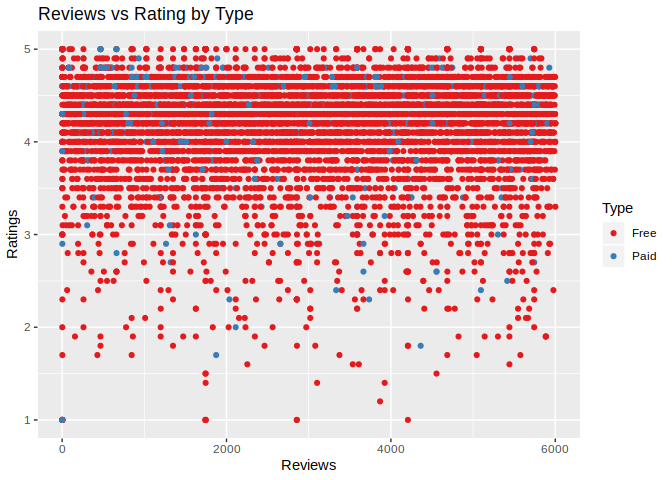

``` r
apps_versions_dataset %>%
  ggplot(
    aes(
      x = Reviews,
      y = Rating,
      color = Content.Rating)) +
  scale_color_manual(
    name = "Content Rating",
    labels = levels(apps_versions_dataset$Content.Rating),
    values = colors) +
  geom_point() +
  ggtitle("Reviews vs Rating by Content Rating") +
  xlab("Reviews") +
  ylab("Ratings")
```

    ## Warning: Removed 1476 rows containing missing values (geom_point).

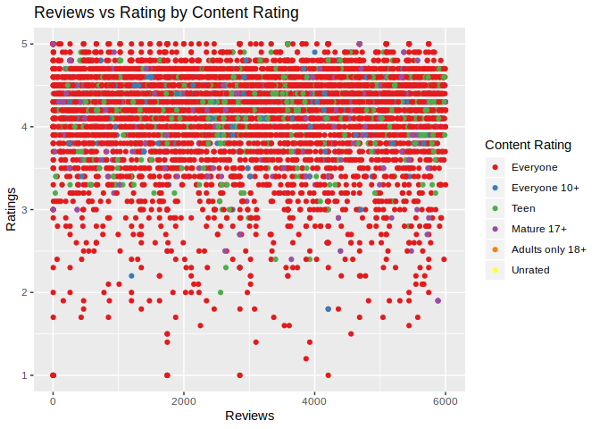

Shaped-coded Scatterplot
------------------------

``` r
apps_versions_dataset %>%
  ggplot(
    aes(
      x = Reviews,
      y = Rating,
      shape = Type)) +
  scale_shape_manual(
    name = "Type",
    labels = c("Free","Paid"),
    values = shapes) +
  geom_point() +
  ggtitle("Reviews vs Rating by Type") +
  xlab("Reviews") +
  ylab("Ratings")
```

    ## Warning: Removed 1476 rows containing missing values (geom_point).

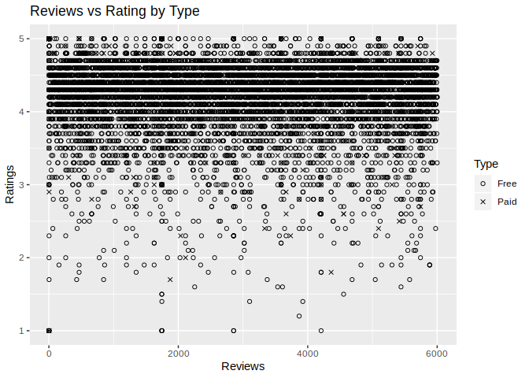

``` r
apps_versions_dataset %>%
  ggplot(
    aes(
      x = Reviews,
      y = Rating,
      shape = Content.Rating)) +
  scale_shape_manual(
    name = "Content Rating",
    labels = levels(apps_versions_dataset$Content.Rating),
    values = shapes) +
  geom_point() +
  ggtitle("Reviews vs Rating by Content Rating") +
  xlab("Reviews") +
  ylab("Ratings")
```

    ## Warning: Removed 1476 rows containing missing values (geom_point).

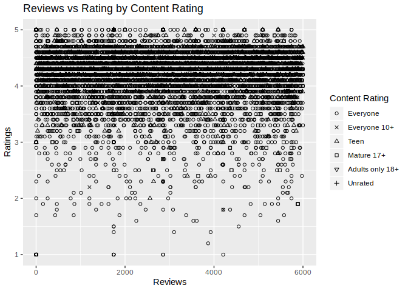

Faceted Scatterplot
-------------------

``` r
apps_versions_dataset %>%
  ggplot(
    aes( 
      x = Reviews, 
      y = Rating))+
  geom_point() +
  facet_wrap( facets = ~Type) +
  ggtitle("Reviews vs Rating by Type") +
  xlab("Reviews") +
  ylab("Ratings") +
  expand_limits(y = 0)
```

    ## Warning: Removed 1476 rows containing missing values (geom_point).

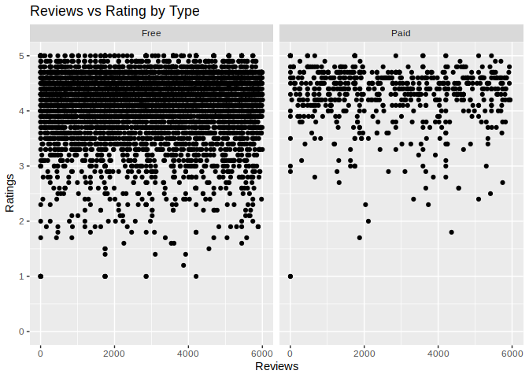

``` r
apps_versions_dataset %>%
  ggplot(aes(
    x = Reviews,
    y = Rating)) +
  geom_point() +
  facet_wrap(
    facets = ~Content.Rating) +
  ggtitle("Reviews vs Rating by Content Rating") +
  xlab("Reviews") +
  ylab("Ratings") +
  expand_limits(y = 0)
```

    ## Warning: Removed 1476 rows containing missing values (geom_point).

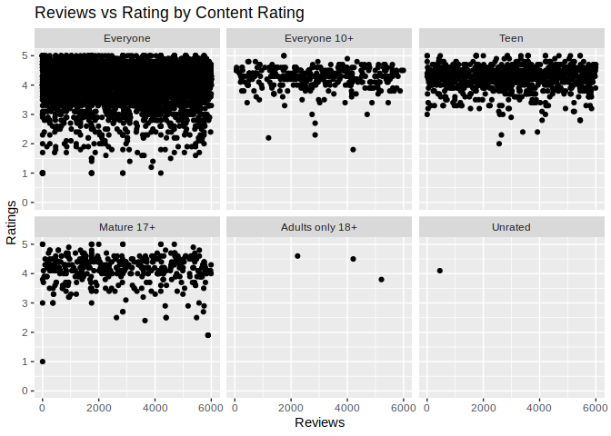

Multi-series Line Chart
-----------------------

``` r
typeTimeSeries <- apps_versions_dataset %>%
  filter(!is.na(Rating)) %>%
  mutate(Year = year(Last.UpdatedDate)) %>%
  select(Year,Type,Rating) %>%
  group_by(Year, Type) %>%
  summarize(Rating = mean(Rating)) %>%
  as.data.frame()

typeTimeSeries %>%
  ggplot(aes(
    x = Year,
    y = Rating,
    color = Type)) +
  geom_line() +
  ggtitle("Rating over time by Type") +
  xlab("Year") +
  ylab("Rating") +
  expand_limits(y = 0)
```

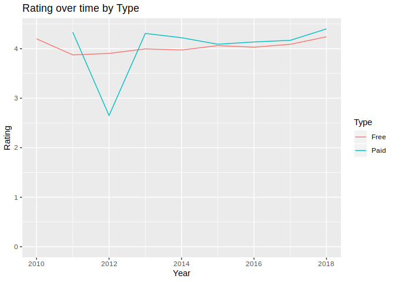

``` r
contentTimeSeries <- apps_versions_dataset %>%
  filter(!is.na(Rating)) %>%
  mutate(Year = year(Last.UpdatedDate)) %>%
  select(Year, Content.Rating, Rating) %>%
  group_by(Year, Content.Rating) %>%
  summarize(Rating = mean(Rating)) %>%
  as.data.frame()

contentTimeSeries %>%
  ggplot(aes(
    x = Year,
    y = Rating,
    color = Content.Rating)) +
  geom_line() +
  ggtitle("Rating over time by Content Rating") +
  xlab("Year") +
  ylab("Rating") +
  expand_limits( y = 0)
```

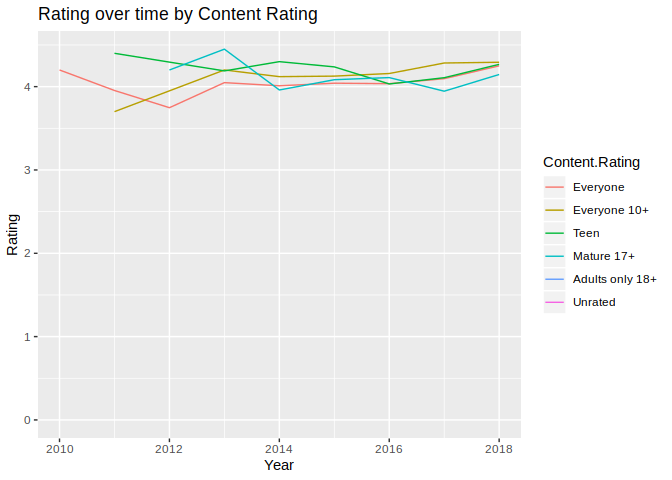

Stacked Area Chart
------------------

``` r
typeTimeSeries %>%
  ggplot(aes(
    x = Year,
    y = Rating,
    fill = Type)) +
  geom_area()+
  ggtitle("Rating over time by Type") +
  xlab("Year") +
  ylab("Rating") +
  expand_limits(y = 0)
```

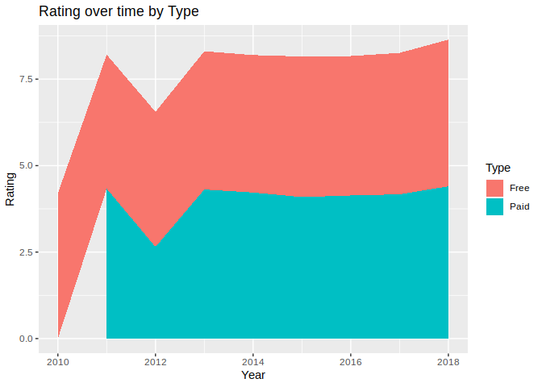

``` r
contentTimeSeries %>%
  ggplot(aes(
    x = Year,
    y = Rating,
    fill = Content.Rating)) +
  geom_area() +
  ggtitle("Rating over time by Content Rating") +
  xlab("Year") +
  ylab("Rating") +
  expand_limits( y = 0)
```

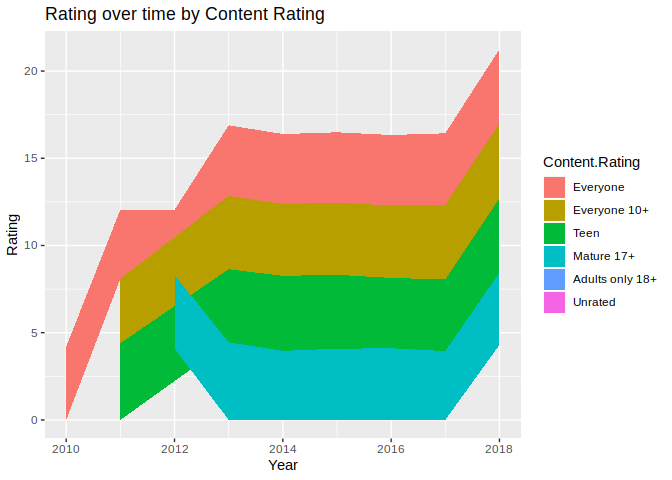

Faceted Line Chart
------------------

``` r
typeTimeSeries %>%
  ggplot(aes(
    x = Year,
    y = Rating)) +
  geom_line() +
  facet_wrap(facets = ~Type) +
  ggtitle("Rating over time by Type") +
  xlab("Year") +
  ylab("Rating") +
  expand_limits(y = 0)
```

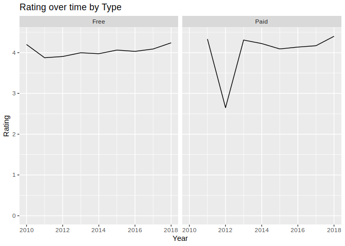

``` r
contentTimeSeries %>%
  ggplot(aes(
    x = Year,
    y = Rating)) +
  geom_line() +
  facet_wrap( facets = ~Content.Rating ) +
  ggtitle("Rating over time by Content Rating") +
  xlab("Year") +
  ylab("Rating") +
  expand_limits( y = 0)
```

    ## geom_path: Each group consists of only one observation. Do you need to
    ## adjust the group aesthetic?
    ## geom_path: Each group consists of only one observation. Do you need to
    ## adjust the group aesthetic?

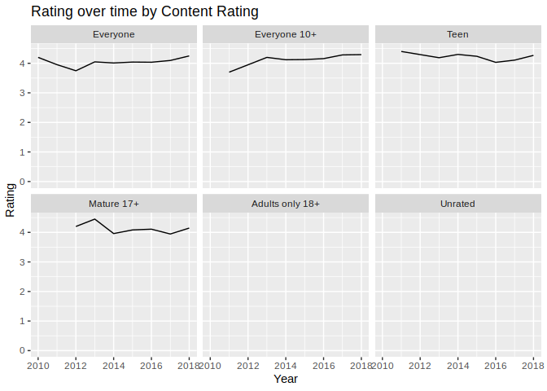
