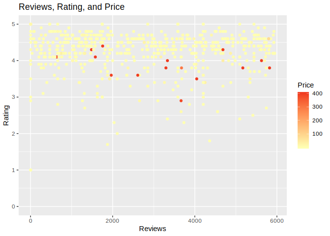
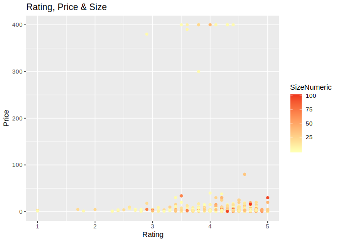
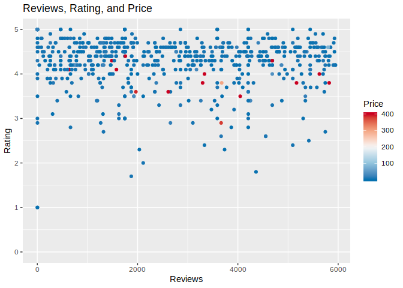
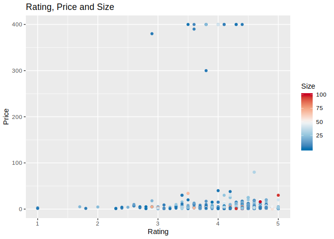
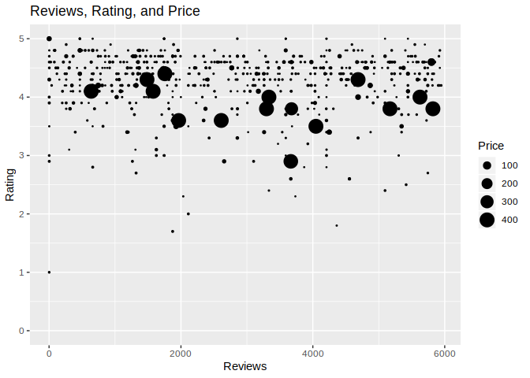
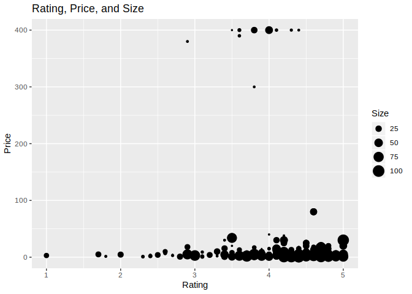
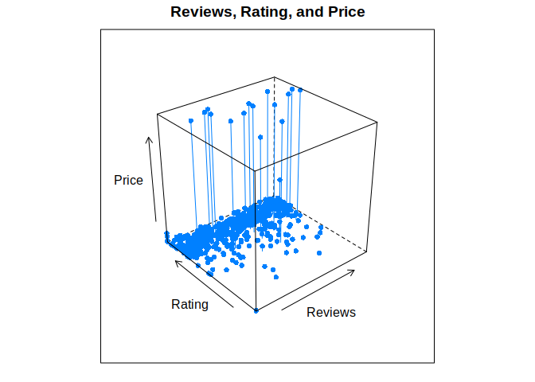
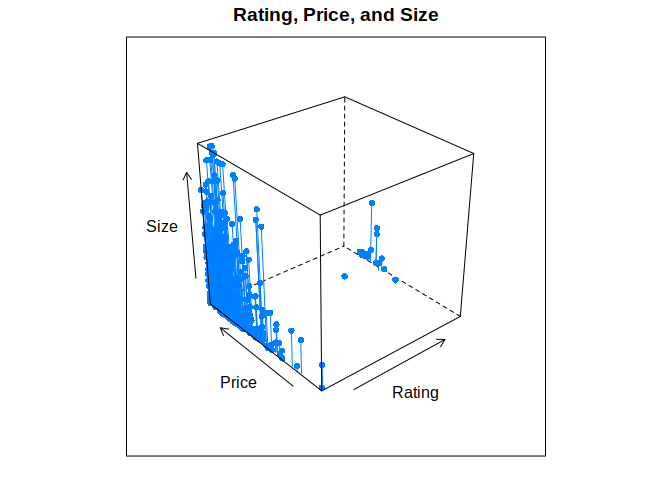

Quantitative Trivariate Analysis
================

Setup Environment
=================

From the previous course I created the rda file for the Google Play App, also in there is the data wrangling process and original source from kaggle.com, if you want to see where the data is coming from and how it was transformed, you can take a look at [here](https://github.com/irmoralesb/BeginningDataVisualizationWithR).

Quantitative Variables

    * Ratings
    * Reviews
    * Size (Numeric)
    * Price

Qualitative Variables

    * Category
    * Installs (Install range)
    * Type (Free/Paid)
    * Content Rating
    * Genre

We are to display the relationship between:

    * Reviews, Rating, Price.
    * Rating, Price, Size.

``` r
library(tidyverse)
```

    ## ── Attaching packages ────────────────────────────────────────────────────────────────────────────────────────────────────────────────────────────── tidyverse 1.2.1 ──

    ## ✔ ggplot2 3.1.0     ✔ purrr   0.3.0
    ## ✔ tibble  2.0.1     ✔ dplyr   0.7.8
    ## ✔ tidyr   0.8.2     ✔ stringr 1.4.0
    ## ✔ readr   1.3.1     ✔ forcats 0.3.0

    ## ── Conflicts ───────────────────────────────────────────────────────────────────────────────────────────────────────────────────────────────── tidyverse_conflicts() ──
    ## ✖ dplyr::filter() masks stats::filter()
    ## ✖ dplyr::lag()    masks stats::lag()

``` r
library(dslabs)
library(RColorBrewer)
library(lubridate)
```

    ## 
    ## Attaching package: 'lubridate'

    ## The following object is masked from 'package:base':
    ## 
    ##     date

``` r
library(lattice)
load("rda/apps_versions_dataset.rda")
gradient <- brewer.pal(6, "YlOrRd")
palette(gradient)
```

Charts/Plots
============

Gradient Color-scale Scatterplot
--------------------------------

``` r
apps_versions_dataset %>%
  filter(Type == "Paid" & !is.na(Rating)) %>%
  ggplot(aes(
    x = Reviews,
    y = Rating,
    color = PriceNumeric)) +
  geom_point() +
  scale_color_gradient(
    low = gradient[1],
    high = gradient[5]) +
  ggtitle("Reviews, Rating, and Price") +
  xlab("Reviews") +
  ylab("Rating") +
  labs(color = "Price") +
  expand_limits(y = 0)
```



``` r
apps_versions_dataset %>%
  filter(Type == "Paid" & !is.na(Rating)) %>%
  ggplot(aes(
    x = Rating,
    y = PriceNumeric,
    color = SizeNumeric)) +
  geom_point() +
  scale_color_gradient(
    low = gradient[1],
    high = gradient[5]) +
  ggtitle("Rating, Price & Size") +
  xlab("Rating") +
  ylab("Price") +
  labs(color = "SizeNumeric") +
  expand_limits(y = 0)
```



Divergent Color-scale Scatterplot
---------------------------------

``` r
divergent <- rev(brewer.pal(5,"RdBu"))
palette(divergent)

apps_versions_dataset %>%
  filter(Type == "Paid" & !is.na(Rating)) %>%
  ggplot(aes(
    x = Reviews,
    y = Rating,
    color = PriceNumeric)) +
  geom_point() +
  scale_color_gradientn(colors = divergent) +
  ggtitle("Reviews, Rating, and Price") +
  xlab("Reviews") +
  ylab("Rating") +
  labs(color = "Price") +
  expand_limits(y = 0)
```



``` r
apps_versions_dataset %>%
  filter(Type == "Paid" & !is.na(Rating)) %>%
  ggplot(aes(
    x = Rating,
    y = PriceNumeric,
    color = SizeNumeric)) +
  geom_point() +
  scale_color_gradientn(colors = divergent) +
  ggtitle("Rating, Price and Size") +
  xlab("Rating") +
  ylab("Price") +
  labs(color = "Size") +
  expand_limits(y = 0)
```



Bubble Chart
------------

``` r
apps_versions_dataset %>%
  filter(Type == "Paid" & !is.na(Rating)) %>%
  ggplot(aes(
    x = Reviews,
    y = Rating,
    size = PriceNumeric, 10)) +
  geom_point() +
  scale_size_area() +
  ggtitle("Reviews, Rating, and Price") +
  xlab("Reviews") +
  ylab("Rating") +
  labs(size = "Price") +
  expand_limits(y = 0)
```



``` r
apps_versions_dataset %>%
  filter(Type == "Paid" & !is.na(Rating)) %>%
  ggplot(aes(
    x = Rating,
    y = PriceNumeric,
    size = SizeNumeric, 10)) +
  geom_point() +
  scale_size_area() +
  ggtitle("Rating, Price, and Size") +
  xlab("Rating") +
  ylab("Price") +
  labs(size = "Size") +
  expand_limits(y = 0)
```



3D Scatterplot
--------------

``` r
apps_versions_dataset %>%
  filter(Type == "Paid" & !is.na(Rating)) %>%
  cloud(
    x = PriceNumeric ~ Reviews * Rating,
    type = c("p","h"),
    pch = 16,
    main = "Reviews, Rating, and Price",
    xlab = "Reviews",
    ylab = "Rating",
    zlab = "Price")
```



``` r
apps_versions_dataset %>%
  filter(Type == "Paid" & !is.na(Rating)) %>%
  cloud(
    x = SizeNumeric ~ PriceNumeric * Rating,
    type = c("p","h"),
    pch = 16,
    main = "Rating, Price, and Size",
    xlab = "Rating",
    ylab = "Price",
    zlab = "Size")
```


