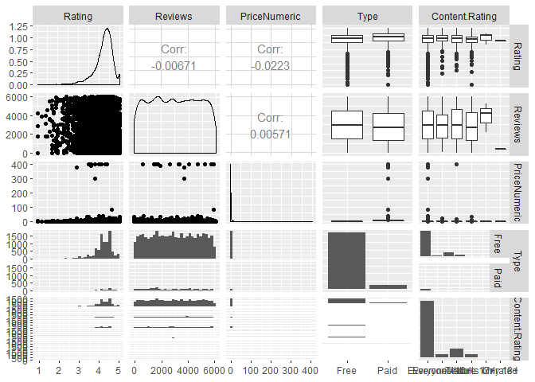

Multivariate Analysis
================

Setup Environment
=================

From the previous course I created the rda file for the Google Play App, also in there is the data wrangling process and original source from kaggle.com, if you want to see where the data is coming from and how it was transformed, you can take a look at [here](https://github.com/irmoralesb/BeginningDataVisualizationWithR).

Quantitative Variables

    * Ratings
    * Reviews
    * Size (Numeric)
    * Price

Qualitative Variables

    * Category
    * Installs (Install range)
    * Type (Free/Paid)
    * Content Rating
    * Genre

We are to display the relationship between:

    * Reviews, Rating, Price, Size.

``` r
library(tidyverse)
```

    ## Warning: package 'tidyverse' was built under R version 3.5.2

    ## -- Attaching packages ---------------------------------------------------------------------------------------------------------------------------------- tidyverse 1.2.1 --

    ## v ggplot2 3.1.0       v purrr   0.3.0  
    ## v tibble  2.0.1       v dplyr   0.8.0.1
    ## v tidyr   0.8.2       v stringr 1.4.0  
    ## v readr   1.3.1       v forcats 0.4.0

    ## Warning: package 'ggplot2' was built under R version 3.5.2

    ## Warning: package 'tibble' was built under R version 3.5.2

    ## Warning: package 'tidyr' was built under R version 3.5.2

    ## Warning: package 'readr' was built under R version 3.5.2

    ## Warning: package 'purrr' was built under R version 3.5.2

    ## Warning: package 'dplyr' was built under R version 3.5.2

    ## Warning: package 'stringr' was built under R version 3.5.2

    ## Warning: package 'forcats' was built under R version 3.5.2

    ## -- Conflicts ------------------------------------------------------------------------------------------------------------------------------------- tidyverse_conflicts() --
    ## x dplyr::filter() masks stats::filter()
    ## x dplyr::lag()    masks stats::lag()

``` r
library(corrgram)
```

    ## Warning: package 'corrgram' was built under R version 3.5.3

``` r
library(reshape2)
```

    ## Warning: package 'reshape2' was built under R version 3.5.2

    ## 
    ## Attaching package: 'reshape2'

    ## The following object is masked from 'package:tidyr':
    ## 
    ##     smiths

``` r
library(GGally)
```

    ## Warning: package 'GGally' was built under R version 3.5.3

    ## 
    ## Attaching package: 'GGally'

    ## The following object is masked from 'package:dplyr':
    ## 
    ##     nasa

``` r
load("rda/apps_versions_dataset.rda")

#Create correlation matrix

correlations <- cor(apps_versions_dataset[!is.na(apps_versions_dataset$Rating),c(3,4,13,15)])
melted <- melt(correlations)  
round(correlations,2)  
```

    ##              Rating Reviews PriceNumeric SizeNumeric
    ## Rating         1.00   -0.01        -0.02        0.09
    ## Reviews       -0.01    1.00         0.01        0.01
    ## PriceNumeric  -0.02    0.01         1.00       -0.02
    ## SizeNumeric    0.09    0.01        -0.02        1.00

Charts/Plots
============

Correlogram
-----------

``` r
melted %>%
  ggplot(aes(
    x = Var1,
    y = Var2,
    fill = value)) +
  geom_tile() +
scale_fill_gradient2(
  low = "red",
  mid = "white",
  high = "blue",
  limit = c(-1,1),
  midpoint = 0)
```


Scatterplot Matrix
------------------

``` r
apps_versions_dataset %>%
  filter(!is.na(Rating)) %>%
  ggpairs(columns = c(3,4,13,7,9))
```

    ## `stat_bin()` using `bins = 30`. Pick better value with `binwidth`.
    ## `stat_bin()` using `bins = 30`. Pick better value with `binwidth`.
    ## `stat_bin()` using `bins = 30`. Pick better value with `binwidth`.
    ## `stat_bin()` using `bins = 30`. Pick better value with `binwidth`.
    ## `stat_bin()` using `bins = 30`. Pick better value with `binwidth`.
    ## `stat_bin()` using `bins = 30`. Pick better value with `binwidth`.



Parallel Coordinates Plot
-------------------------

``` r
ggparcoord(head(apps_versions_dataset, n=100),c(3,4,13,7,9))
```


